# 源码编译（1）——Android 6.0源码编译

[TOC]


## 一、前言

最近在研究Xposed框架定制，恰好又看到看雪上两个大佬关于[源码定制](https://bbs.pediy.com/thread-255836.htm)和[Xposed源码定制](https://bbs.pediy.com/thread-255836.htm)的帖子，所以尝试基于Android6.0版本，详细记录一下从源码下载到Xposed框架定制的全过程。

## 二、Android 源码下载

### 1.环境准备

| **实验平台：** | **Ubuntu 16.0.4  **         |
| -------------- | --------------------------- |
| **运行内存：** | **(物理内存4G+交换内存8G)** |
| **磁盘空间：** | **300G**                    |

#### （1）内存配置

我们首先给虚拟机分配一个物理内存4G 然后设置虚拟内存8G，开始实验之前记得快照，考虑到源码编译可能需要很大的内存，我们提前配置好交换内存

```java
（1）在Home目录创建一个大小为8G的swap文件
$ sudo dd if=/dev/zero of=/swapfile bs=1M count=8k  
注：从 /dev/zero 文件读出内容并存到/swapfile文件中，块大小为1MByte，总共 16K 个块，也就是总共 8GB
（2）格式化新增的swap文件：
$ sudo mkswap /swapfile
（3）启动新增的swap文件
$ sudo swapon /swapfile
（4）通过free命令就可以看到，swap分区增大了8G
$ free
（5）关闭新增的swap文件
$ sudo swapoff /swapfile
 再次通过free命令就可以看到，swap分区减小了8G
（6）开机后自动启动新增的swap文件，在/etc/fstab中新增如下命令
$ vim /etc/fstab
/swapfile       none    swap    sw      0       3
```

#### （2）磁盘扩展

我们可以为虚拟机设置一个比较大的磁盘空间，但是如果你的虚拟机已经分配了一个磁盘空间，可能你需要扩展你的磁盘空间，这里可以详细参考[磁盘空间扩展](https://blog.csdn.net/qq_37294163/article/details/106468619)，去扩大你的虚拟机磁盘，这里最好保证自己的磁盘空间充足。

### 2.配置adb和fastboot

#### （1）下载platform-tools压缩包

我们到后面需要使用adb和fastboot，所以我们需要下载[platform-tools资源包]( https://dl.google.com/android/repository/platform-tools_r30.0.5-linux.zip)

然后我们解压到自己的目录

```java
mkdir -p /home/user/Android
unzip platform-tools_r30.0.5-linux.zip  -d  /home/user/Android
```

#### （2）配置环境变量

我们配置环境变量

```
vim  ~/.bashrc
添加：
#add Android Sdk  platform tools to path
#add START
export ADB_PATH=/home/tom/Android/platform-tools
export PATH=$PATH:$ADB_PATH
#add END
激活环境：
source ~/.bashrc 
```

我们可以测试一下配置：

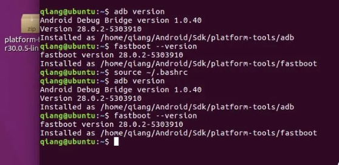

#### （3）安装repo命令

创建必要目录，git-repo工具保存目录，这里需要保存在bin目录下，不然后面可能出问题

```
mkdir /home/tom/bin ##没有就创建
```

由于使用Google的repo源需要挂代理，所以我们使用清华的源repo源，无需挂代码就可以很快下载Android源码了

```java
curl https://mirrors.tuna.tsinghua.edu.cn/git/git-repo -o /home/tom/bin/repo
cp repo ~/bin/ 
```

后面是对应的repo保存路径

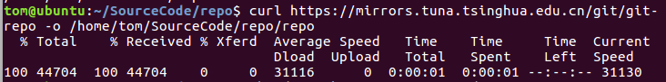

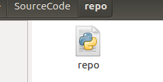

设置权限：

```java
chmod +x /home/tom/bin/repo
```

由于bin的环境变量已经配置过了，所以我们只需要去加入REPO_URL，来更新镜像源

配置环境变量：

```java
vim  ~/.bashrc
##在bashrc中添加
export REPO_URL='https://mirrors.tuna.tsinghua.edu.cn/git/git-repo'
##激活环境变量
source  ~/.bashrc
```

配置环境变量或下载repo失败时，注意一下空格，大部分是此原因导致的

#### （4）下载源码

从[清华的镜像源官网](https://mirrors.tuna.tsinghua.edu.cn/help/AOSP/)上我们可以看见有两种方法：

##### <1>使用每月更新的初始化包

我们初始化代码仓库：

```
cd /home/tom/SourceCode/
```

我们下载初始包，我们需要下载最新的aosp-latest.tar文件以及对应的md5值，[官方镜像网址](https://mirrors.tuna.tsinghua.edu.cn/aosp-monthly/)

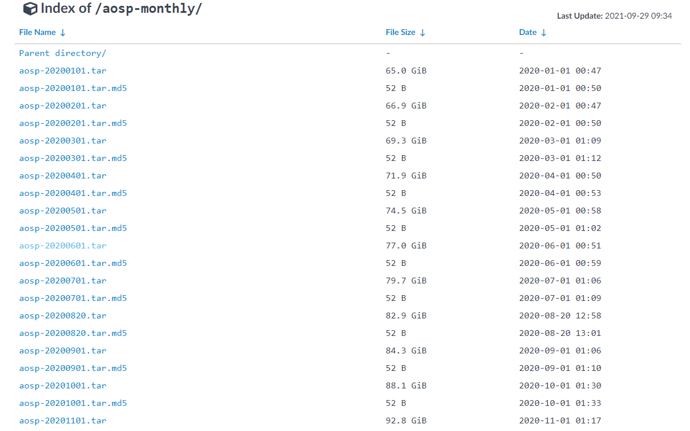

我们可以验证文件的完整性，进行MD5校验

```
md5sum aosp-latest.tar
```

下载完毕后可以使用tar -zxvf aosp-latest.jar指令解压该文件，解压出来文件夹名称为aosp，里面只有一个叫.repo的隐藏文件夹，该文件夹就是仓库，安卓源代码都在里面，可以使用CTRL+H来查看该隐藏文件夹

```
tar -zxvf aosp-latest.jar
```

然后我们只需要在目标文件夹下同步即可

```
repo sync
```

##### <2>传统的初始化方法

我们进入我们的目标文件夹

```
cd SourceCode/Android6
```

然后我们初始化厂库：

```
repo init -u https://mirrors.tuna.tsinghua.edu.cn/git/AOSP/platform/manifest -b android-6.0.1_r20
```

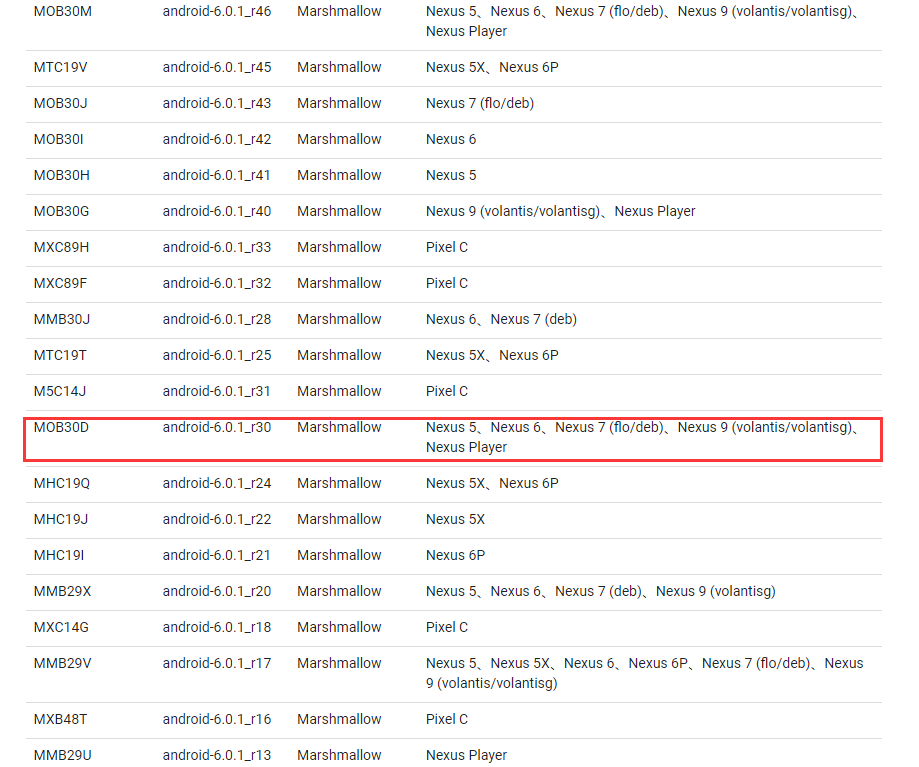

这里注意我们的每个分支应该根据我们的设备情况而选定，详细参考官网:[Android源码](https://source.android.com/source/build-numbers#source-code-tags-and-builds)

初始化成功后，系统将显示一条消息，告诉您 Repo 已在工作目录中完成初始化。客户端目录中现在应包含一个 `.repo` 目录，清单等文件将保存在该目录下

同步源码树：

```
repo sync
```

#### （5）编写不死脚本

由于我们在下载源码的过程中，时间太长可能会中途失败，所以我们需要编写不死脚本down.sh，保持运行

```java
#!/bin/bash
echo  "==========start repo sync==="
repo init -u https://mirrors.tuna.tsinghua.edu.cn/git/AOSP/platform/manifest -b android-6.0.1_r20
repo sync -j4 -d --force-sync --no-clone-bundle
while [ $? = 1 ]; do  
        echo “======sync failed, re-sync again======”  
        sleep 3  
        repo sync -j4 -d --force-sync --no-clone-bundle
done 
```

然后我们将down.sh启动

```java
chmod a+x down.sh
./down.sh
```

## 三、Android 源码编译

### 1.实验准备

#### （1）实验环境

由于关于源码下载的过程比较缓慢，这里方便实验，就不演示下载的流程了，这里会给大家在附件提供各个版本的android系统源码，方便大家进行实验，本文所需要的实验：

| **实验平台：**    | **Ubuntu 16.0.4  (运行内存4GB+CPU 4+磁盘300G)** |
| ----------------- | ----------------------------------------------- |
| **Android源码：** | **android-6.0.1_r1**                            |
| **实验手机**      | **Google nexus5**                               |

#### （2）JDK配置

我们在Android源码编译过程中，一定要注意对应Android版本的平台要求，和Android版本所需要的JDK版本，参考[官方网址](https://source.android.com/source/requirements)：

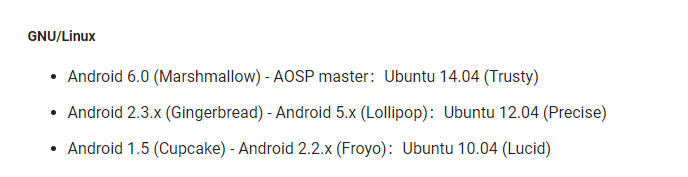

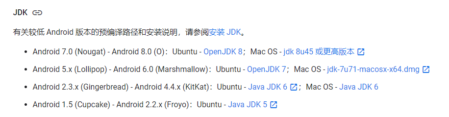

##### <1> 常见方法

经过网上的资料查找，考虑到Ubuntu16仓库里面的镜像已经没有OpenJDK7的版本，所以要替换镜像源：

首先进行备份一下：

```
sudo  cp   /etc/apt/sources.list   /etc/apt/sources.list.bak
```

进行修改：

```
sudo gedit /etc/apt/sources.list
```

下面是一些镜像源：

阿里源

[官方配置](https://developer.aliyun.com/mirror/ubuntu?spm=a2c6h.13651102.0.0.9c371b11kyC5Oh)

```java
deb http://mirrors.aliyun.com/ubuntu/ xenial main
deb-src http://mirrors.aliyun.com/ubuntu/ xenial main

deb http://mirrors.aliyun.com/ubuntu/ xenial-updates main
deb-src http://mirrors.aliyun.com/ubuntu/ xenial-updates main

deb http://mirrors.aliyun.com/ubuntu/ xenial universe
deb-src http://mirrors.aliyun.com/ubuntu/ xenial universe
deb http://mirrors.aliyun.com/ubuntu/ xenial-updates universe
deb-src http://mirrors.aliyun.com/ubuntu/ xenial-updates universe

deb http://mirrors.aliyun.com/ubuntu/ xenial-security main
deb-src http://mirrors.aliyun.com/ubuntu/ xenial-security main
deb http://mirrors.aliyun.com/ubuntu/ xenial-security universe
deb-src http://mirrors.aliyun.com/ubuntu/ xenial-security universe
```

清华源

[官方配置](https://mirror.tuna.tsinghua.edu.cn/help/ubuntu/)

```java
# 默认注释了源码镜像以提高 apt update 速度，如有需要可自行取消注释
deb https://mirrors.tuna.tsinghua.edu.cn/ubuntu/ xenial main restricted universe multiverse
# deb-src https://mirrors.tuna.tsinghua.edu.cn/ubuntu/ xenial main restricted universe multiverse
deb https://mirrors.tuna.tsinghua.edu.cn/ubuntu/ xenial-updates main restricted universe multiverse
# deb-src https://mirrors.tuna.tsinghua.edu.cn/ubuntu/ xenial-updates main restricted universe multiverse
deb https://mirrors.tuna.tsinghua.edu.cn/ubuntu/ xenial-backports main restricted universe multiverse
# deb-src https://mirrors.tuna.tsinghua.edu.cn/ubuntu/ xenial-backports main restricted universe multiverse
deb https://mirrors.tuna.tsinghua.edu.cn/ubuntu/ xenial-security main restricted universe multiverse
# deb-src https://mirrors.tuna.tsinghua.edu.cn/ubuntu/ xenial-security main restricted universe multiverse

# 预发布软件源，不建议启用
# deb https://mirrors.tuna.tsinghua.edu.cn/ubuntu/ xenial-proposed main restricted universe multiverse
# deb-src https://mirrors.tuna.tsinghua.edu.cn/ubuntu/ xenial-proposed main restricted universe multiverse
```

ubuntu镜像

```java
deb http://cn.archive.ubuntu.com/ubuntu/ groovy main universe restricted multiverse
deb-src http://cn.archive.ubuntu.com/ubuntu/ groovy main universe restricted multiverse #Added by software-properties
deb http://security.ubuntu.com/ubuntu/ groovy-security main universe restricted multiverse
deb-src http://cn.archive.ubuntu.com/ubuntu/ groovy-security main universe restricted multiverse #Added by software-properties
deb http://cn.archive.ubuntu.com/ubuntu/ groovy-updates main universe restricted multiverse
deb-src http://cn.archive.ubuntu.com/ubuntu/ groovy-updates main universe restricted multiverse #Added by software-properties
```

然后我们需要将apt install更新一下

```
# apt-get update
```

然后我们需要向ubuntu的镜像里面添加openjdk7 的仓库，开始下载：

```java
sudo add-apt-repository ppa:openjdk-r/ppa
sudo apt-get update
sudo apt-get install openjdk-7-jdk
```

这样就可以将openjdk7下载完成，但是这里好像并不适用，所以我在这里直接给出我找到的压缩包，大家解压一些就可以了

##### <2> 压缩包解压

我们将压缩包直接解压，压缩包见附件

```java
tar -zxvf jdk-7u80-linux-i586.tar.gz
```

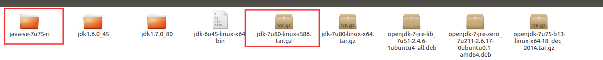

配置环境变量：

```java
sudo gedit /etc/profile
在文件最后添加环境变量
export JAVA_HOME=/home/tom/bin/java-se-7u75-ri
export CLASSPATH=.:$JAVA_HOME/lib/dt.jar:$JAVA_HOME/lib/tools.jar
export PATH=$PATH:$JAVA_HOME/bin
```

激活环境变量

```
source /etc/profile
```

检测jdk版本

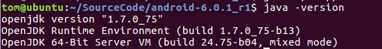

这样我们的jdk环境就配置完成，当然我们为了方便后续多版本切换，我们还可以设置jdk版本切换

#### （3）JDK版本切换

##### <1>设置序列号

我们需要使用update-alternatives设置序列号方便我们选择

```java
# update-alternatives  --install  /usr/bin/java  java  /home/tom/bin/java-se-7u75-ri/bin/java  3
# update-alternatives  --install  /usr/bin/javac  javac  /home/tom/bin/java-se-7u75-ri/bin/javac  3
```

##### <2>切换设置jdk版本

```java
 # update-alternatives  --config  java
```

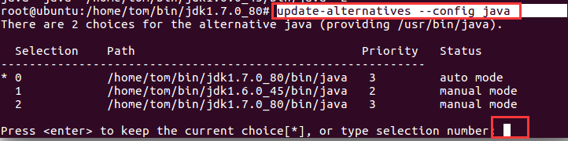

我们选择对于的版本序号

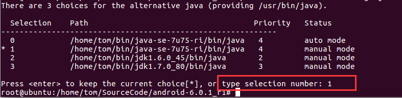

然后我们再次验证版本：

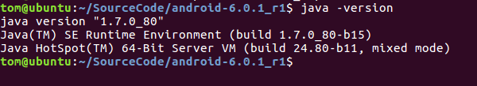

我们可以同样的配置javac，这样我们就可以完成jdk的版本切换了

##### <3>删除设置版本

```java
update-alternatives –remove java /home/tom/bin/java-se-7u75-ri/bin/java
```

#### （4）常见错误

下面主要介绍jdk配置引起的错误：

##### <1>错误1


原因分析：

```
（1）这可能是仓库中没有openjdk引起
（2）这可能是没有更新apt的下载源
```

解决办法：

切换镜像源，然后更新 apt-get update，详细可以参考上文常见方法中镜像源的设置

##### <2>错误2

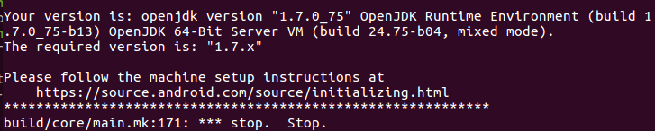

原因分析：

```java
（1）使用java版本选择工具可能无法识别到jdk1.7
（2）进行make会提示jdk1.7是不能识别的openJDK1.7，这里主要是makefile里的正则表达式判断失误，所以需要修改makefile
```

解决办法：

1.修改安卓源码目录下的/build/envsetup.sh

```
sudo gedit build/envsetup.sh
直接搜索set_java_home
然后将三处地方修改成我们的路径
```

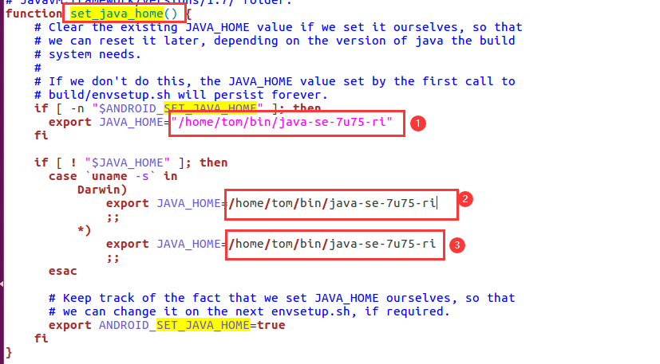

2.注释版本检测的终止语句

```java1
# 编辑主make文件
sudo gedit build/core/main.mk
# 注释掉第 171 行的终止命令
# $(error stop)
```

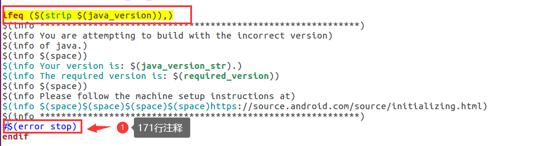

保存后按照正常的编译命令进行make就可以了

##### <3>错误3

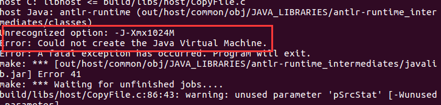

原因分析：

```java
经过检查原来是我们javac环境没有切换，我们将javac环境切换，然后重新编译
```

解决办法：

配置javac

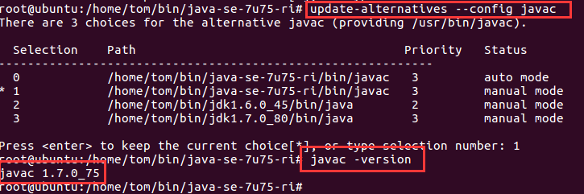

##### <4>错误4

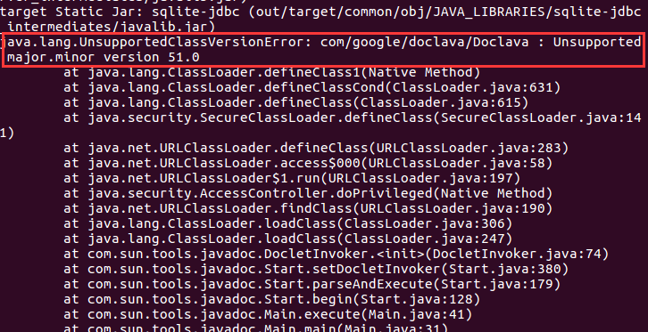

原因分析：

```
这是由于javadoc没有配置导致的
```

问题解决：

配置javadoc

```java
# update-alternatives  --install  /usr/bin/javadoc  javadoc  /home/tom/bin/java-se-7u75-ri/bin/javadoc  3
```

### 2.环境配置

#### （1）源码准备

我们可以通过使用repo来从官方的镜像来下载Android源码，但是这样需要的时间较长，这里我们直接提供了各个版本系统源码的压缩包，大家直接导入后，进行解压即可

```
解压命令：tar -zxvf android-6.0.1_r1
```


#### （2）配置驱动文件

我们需要下载对应设备的驱动文件，这里我们使用的是Google nexus5，我们可以去[官方网址](https://developers.google.com/android/drivers#hammerheadktu84p)下载：

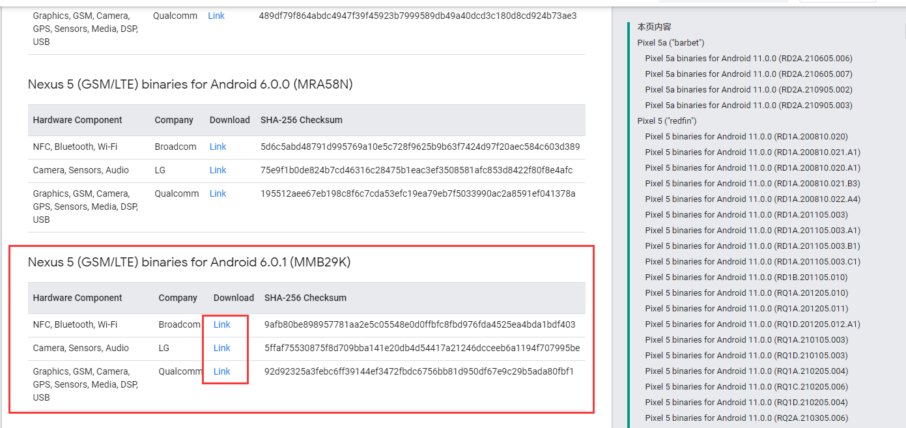

我们可以看到这里的设备驱动型号很多，我们可以根据我们的设备型号去选择对应的设备驱动，这里我们就将这三个设备驱动下载并放入我们的源码下

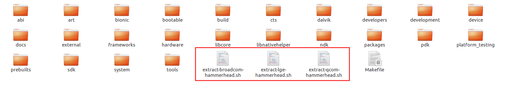

然后我们依次的运行驱动文件

```java
sh extract-broadcom-hammerhead.sh
```

按Enter键一行行的查看，经过实验，当不停的确认到了8条后e结束，需要我们输入`I ACCEPT`，这样就解压到了vendor 目录下，其他两个脚本同样这样执行

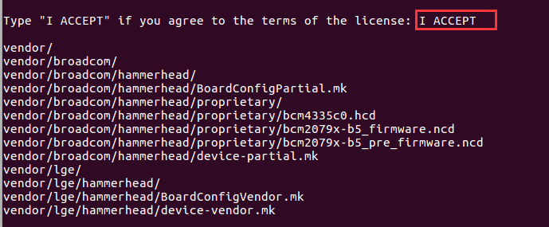

三个文件解压后的目录：

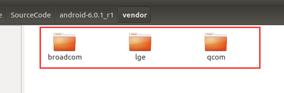

#### （3）初始化编译环境

##### <1>修改源码

首先我们需要修改源码，修改源码文件中：`art/build/Android.common_build.mk`里的内容

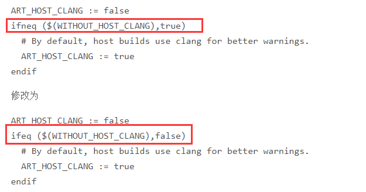

不然容易报错：

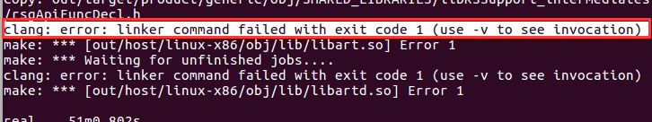

原因分析：

```java
	修改的目的是把 CLANG 这个编译选项关掉，这个错误只会在 Ubuntu16.04 上遇到，Ubuntu14.04 则不存在这个问题
```

##### <2>设置高速缓存

我们在编译源码之前为了提高编译的速率：

在 .bashrc文件末尾添加：export USE_CCACHE = 1

```
echo export USE_CCACHE=1 >> ~/.bashrc
```

为了提高编译效率，设置编译器高速缓存:

```
prebuilts/misc/linux-x86/ccache/ccache -M 50G
```

##### <3>清空输出和初始化环境

我们可以在开始编译之前清楚之前所有编译操作的输出，避免出现错误，首次编译不需要：

```
make clobber
```

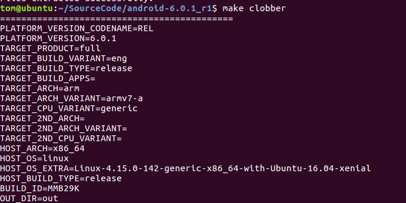

然后使用build目录中的envsetup.sh脚本初始化环境：

```
source build/envsetup.sh 或 . build/envsetup.sh
```


#### （4）选择编译目标

我们选择编译的具体目标，也就是指我们是将我们的源码编译到虚拟机还是具体的手机上运行，这里我们可以先看官方给的[型号图](https://source.android.com/source/running)：

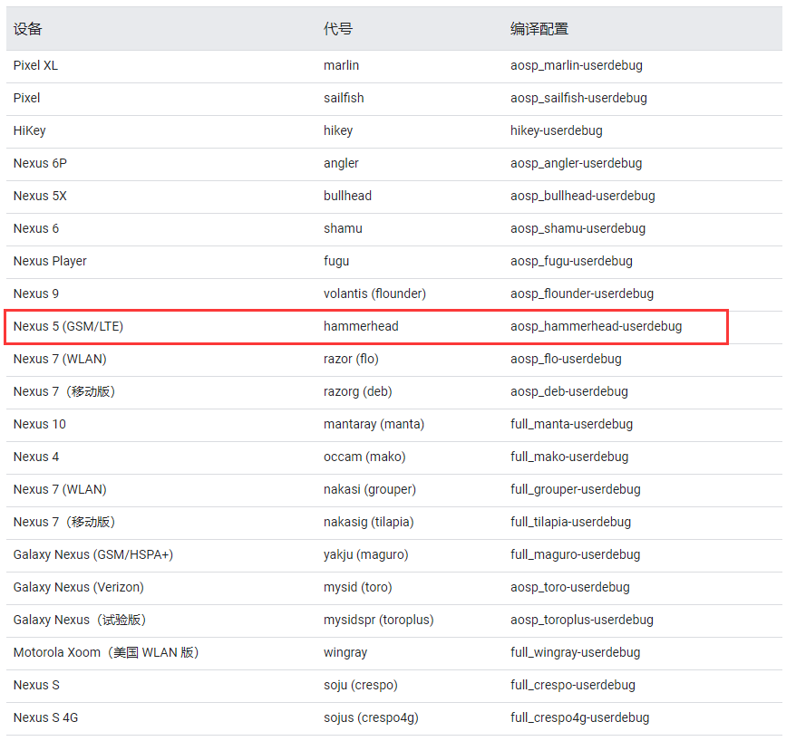

我们输入指令：`lunch`

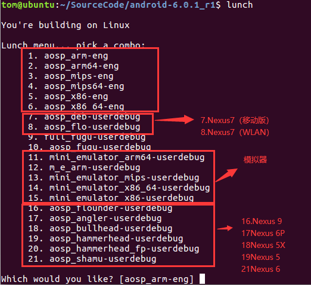

参考官方解释：

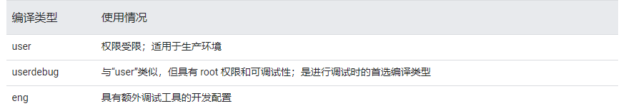

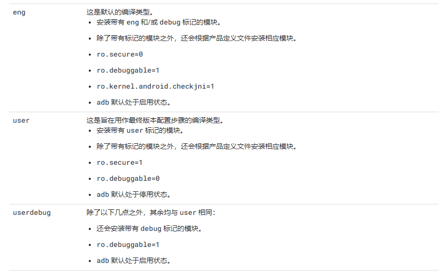

我们可以理解为：

```java
user--------->最终用户机
userdebug---->调试测试机
eng---------->工程机
```

#### （5）编译代码

这里我们开始编译源码，执行make -j4，4为同时编译的线程数，大家可以根据自己的设备情况选择

```
make -j4
```

查看cpu核心个数命令：

```
cat  /proc/cpuinfo
```

编译结束，经过了漫长的过程，我们总算可以看见我们编译成功

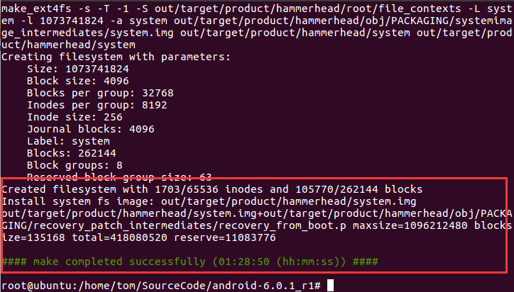

我们进入输出的目录文件夹下：

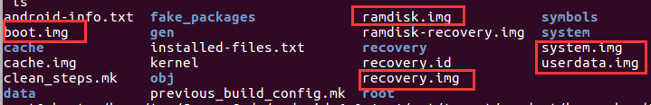

Android镜像结构分析详细可以见（8）

#### （7）编写刷机脚本

我们将手机进入bootloader模式：

```
adb reboot bootloader 
```

手机如果没有解锁，我们需要解锁

```
fastboot oem unlock
```

我们将选中镜像导出，并刷入手机，编写刷机脚本，windows上文件后缀.bat，linux上文件后缀.sh

```
fastboot flash boot boot.img
fastboot flash system system.img
fastboot flash cache cache.img
fastboot flash userdata userdata.img
fastboot reboot
```

然后我们启动刷机脚本，就可以看见手机正常的刷入

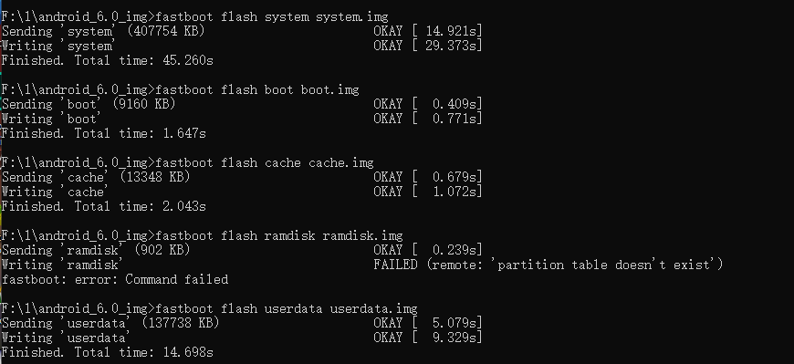


#### （8）Android主要镜像解析

刷机包目录：

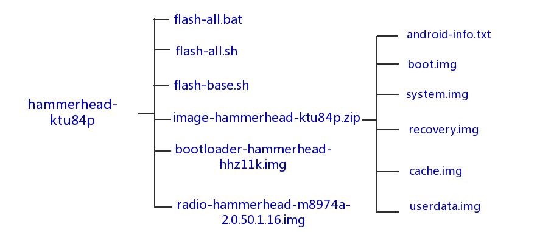

主要镜像：

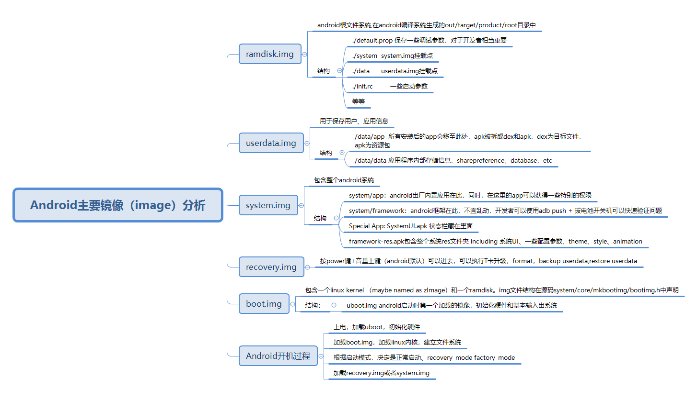

详细参考博客：[android 主要镜像（image）解析](https://blog.csdn.net/wutianyin222/article/details/7854375?utm_medium=distribute.pc_relevant.none-task-blog-2%7Edefault%7ECTRLIST%7Edefault-3.searchformbaiduhighlight&depth_1-utm_source=distribute.pc_relevant.none-task-blog-2%7Edefault%7ECTRLIST%7Edefault-3.searchformbaiduhighlight)

#### （9）常见错误

##### <1>错误1

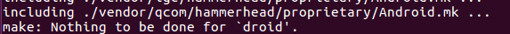

类似错误：make:Nothing to be done for 'all_modules' 或 make:***No rule to make target Android.mk Stop等

解决办法：

```java
（1）进入目录：/out/target/common/obj/JAVA_LIBRARIES，删除services_intermediates这个文件夹
（1）进入目录：/out/target/product/XXX/obj/JAVA_LIBRARIES，删除services_intermediates这个文件夹
```

##### <2>错误2

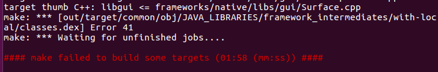

问题分析：

```
这个错误的好像是由于在make一个任务时，并没有结束，这时在进行make就会报
```

我们使用命令：

```
make clobber
```

make clobber的功能是把上一次make命令生成的文件或目录清除掉，效果比make clean更严格

## 四、实验总结

本文详细记录了从Android6.0源码下载到Android源码编译的详细过程，其中参考了看雪上面的两位大佬帖子和网络上的一些博客，中间遇到了很多问题，并逐一解决，这里将所有的错误情况总结并放在了错误区，大家可以详细的对照，通过源码编译的过程，对Android系统的理解更加的深入了，接下来便开始进行Xposed源码的编译和定制，本文有什么问题就请大佬们指正了。

这里给大家提供android版本的源码和OpenJDK7的下载包，大家也可以去github上免费下载，后续都会上传到github上：[github网址](https://github.com/guoxuaa/Android-reverse)

## 五、参考文献

JDK环境配置：

```
（1）https://blog.csdn.net/u014709812/article/details/114584639?utm_medium=distribute.pc_relevant.none-task-blog-2~default~baidujs_baidulandingword~default-1.searchformbaiduhighlight&spm=1001.2101.3001.4242
（2）https://blog.csdn.net/xiangzi10/article/details/95730747
（3）https://forum.xda-developers.com/t/q-kitkat-hammerhead-aosp-compilation-errors.2736673/
（4）https://blog.csdn.net/qq_42824983/article/details/110236257
```

Android源码下载:

```
（1）https://bbs.pediy.com/thread-264521.htm
（2）https://www.cnblogs.com/coffee520/p/9639417.html
（3）https://mirrors.tuna.tsinghua.edu.cn/help/AOSP/
（4）https://source.android.com/source/downloading
```

Android源码编译：

```
（1）https://bbs.pediy.com/thread-218513.htm
（2）https://blog.csdn.net/pengtgimust/article/details/90758507
（3）https://blog.csdn.net/fuchaosz/article/details/51487585
（4）https://juejin.cn/post/6844904191693946887
（5）https://blog.csdn.net/u012417380/article/details/72843185
（6）https://www.cxyzjd.com/article/xjkelwh/103045055
（7）https://blog.csdn.net/cnliwy/article/details/52189349
（8）https://blog.csdn.net/warticles/article/details/81063377
```

