# 源码编译（2）——Xposed源码编译详解

[TOC]


## 一、前言

在上篇帖子中我们完成了Android 6.0 从源码下载到源码编译的全过程，详细可以参考[源码编译（1）——Android6.0源码编译详解](https://bbs.pediy.com/thread-269575.htm)，本文主要讲解Xposed框架源码编译到源码定制的详细过程，实验环境主要是Android 6.0，在此过程中踩过不少坑，遇到各种问题，好在后面都一一解决了，这个过程中尤其感谢一些大佬的博客贴子，从中学习到了很多。本文将从基于我们编译的Android 6.0，从Xposed源码编译到Xposed源码定制，详细记录全过程。此实验分为两部分：本文Xposed源码编译和下文Xposed源码定制

**致谢：**

首先感谢世界美景大佬的[定制Xposed框架](https://bbs.pediy.com/thread-255836.htm)，从里面学习到对Xposed框架特征的修改，但是由于个人水平有限，大佬的贴子不够详细，不能完整复现，经过搜索发现肉丝大佬的基于此的两篇详细的贴子讲解：[来自高纬的对抗：魔改XPOSED过框架检测(上)](https://mp.weixin.qq.com/s/c97zoTxRrEeYLvD8YwIUVQ)和[来自高纬的对抗：魔改XPOSED过框架检测(下)](https://mp.weixin.qq.com/s/YAMCrQSi0LFJGNIwB9qHDA)，本文的Xposed定制详细参考了大佬的贴子，一些bug也是从中得到了解决，而Xposed编译则参考博客：[xposed源码编译与集成](https://www.jianshu.com/p/6471bab49cb1)，关于Xposed安装以及问题解决则参考：[学习篇-xposed框架及高版本替代方案](https://bbs.pediy.com/thread-264160.htm)

## 二、Xposed源码编译

### 1.实验准备

Xposed源码编译的过程中，我们需要详细的了解Xposed中不同模块对应的版本以及适配的Android 版本情况，这样能够帮助我们减少错误，本文实验的环境搭建为：

| **实验平台：**       | **Ubuntu 16.0.4  (运行内存4GB+CPU 4+磁盘300G)** |
| -------------------- | ----------------------------------------------- |
| **Android源码：**    | **android-6.0.1_r1**                            |
| **实验手机：**       | **Google nexus5**                               |
| **XposedBridge：**   | **XposedBridge-art**                            |
| **XposedInstaller:** | **3.1.5**                                       |

### 2.编译流程

我们在学习Xposed的源码编译之前，我们先了解Xposed个各个模块的含义，详细参考官网：[Xposed官网](https://github.com/rovo89)

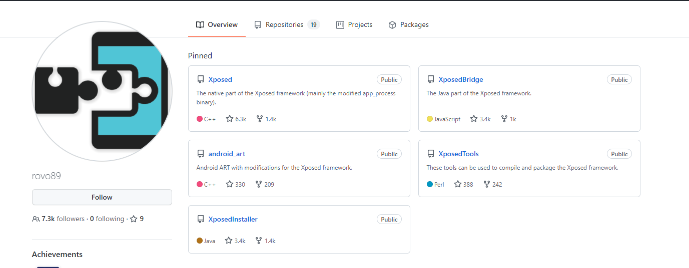

各个模块的含义（这里参考上文肉丝大佬博客（1））：

```java
XposedInstaller：下载安装Xposed.zip刷机包、下载安装和管理模块
XposedBridge：位于Java层的API提供者，模块调用功能时首先就是到这里，然后再“转发”到Native方法
Xposed：位于Native层的Xposed实际实现，实现方法替换的实际逻辑等功能，主要是在app_process上进行的二次开发
android_art：在原版art上进行的二次开发，目录及文件基本上与原版art相同，稍加修改提供对Xposed的支持
XposedTools:XposedInstaller下载的那个刷机zip包，就是用XposedTools编译打包出来的
```

我们了解Xposed的各个模块的作用，接着了解一下Xposed框架初始化的工作原理：

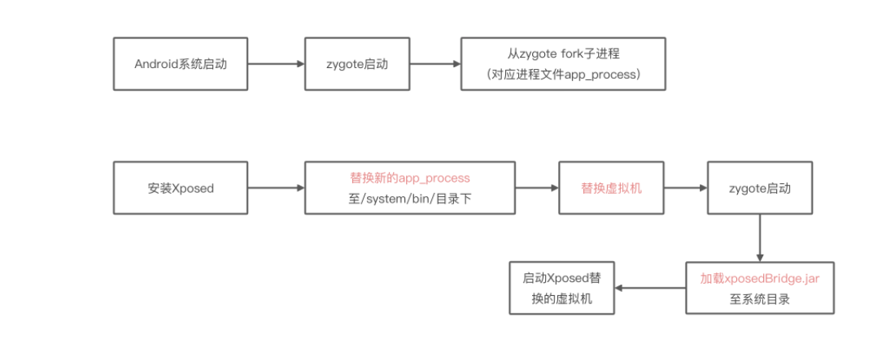

Xposed源码编译的流程可以参考下图：

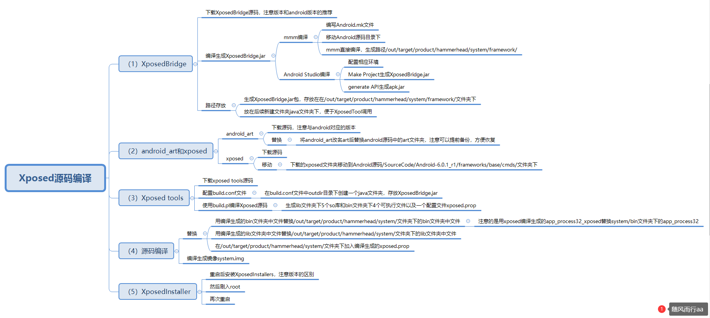

### 3.XposedBridge

#### （1）源码下载

我们从官网上下载[XposedBridge](https://github.com/rovo89/XposedBridge/tree/art)，这里我们最终下载的是Xposed_art

```java
git clone https://github.com/rovo89/XposedBridge.git
```

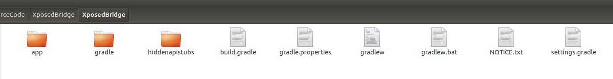

#### （2）编译生成XposedBridge.jar

我们在生成XposedBridge.jar的过程中有两种方式：mmm编译和Android Studio编译（这里优先推荐使用AndroidStudio编译）

##### <1>mmm编译

首先我们需要在XposedBridge工程中编写Android.mk文件

```java
	Android.mk是Android提供的一种makefile文件，用来指定诸如编译生成so库名、引用的头文件目录、需要编译的.c/.cpp文件和.a静态库文件等。编写android.mk文件，将编译需要的源代码，编译生成的结果形式等信息告知ndk build编译系统。Android.mk文件内容如下所示。
```

```java
LOCAL_PATH:= $(call my-dir)
include $(CLEAR_VARS)
LOCAL_DEX_PREOPT = false
LOCAL_MODULE := XposedBridge

LOCAL_SRC_FILES := \
     $(call all-java-files-under, src) \
     $(call all-java-files-under, lib/apache-commons-lang/external) \
     $(call all-java-files-under, hiddenapistubs/src)

include $(BUILD_JAVA_LIBRARY)

$(LOCAL_INTERMEDIA_TARGETS): PRIVATE_EXTRA_JAR_ARGS := -C "$(LOCAL_PATH)" \
assets -C "#(LOCAL_PATH)" NOTICE.txt

include $(call all-makefiles-under, $(LOCAL_PATH))
```

这里我们需要注意版本，针对不同版本的XposedBridge，我们需要修改LOCAL_SRC_FILES中的文件选项，关于Android.mk的文件介绍，大家可以参考官网地址：[Android.mk](https://developer.android.com/ndk/guides/android_mk?hl=zh-cn)


我们将XposedBridge文件夹放在Android源码目录下

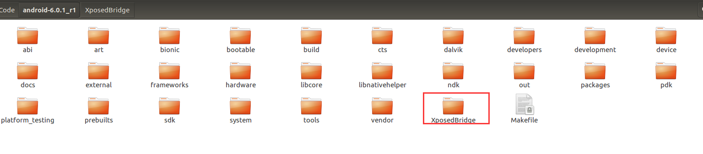

然后我们使用mmm针对模块编译：

```java
##初始化环境
source build/envsetup.sh
##选择设备
lunch 19
##编译
mmm /home/tom/SourceCode/android-6.0.1_r1/XposedBridge/ 
```

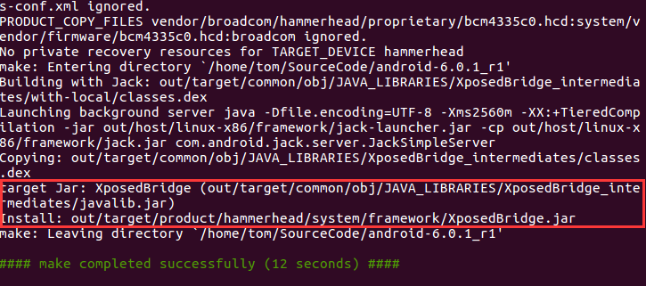

我们就可以在/out/target/product/hammerhead/system/framework/文件夹下看见生成的XposedBridge包


##### <2>android Studio编译

我们先从官网上下载源码，然后我们直接用Android Studio打开

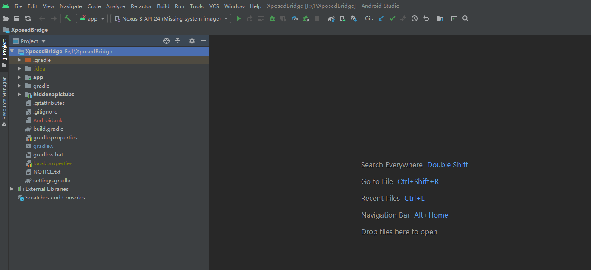

然后我们等待编译器默认配置，此时如果你的编译器没有安装sdk23，可能会报错

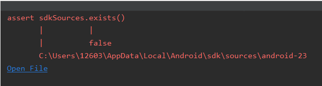

这里我们进入File→Settings→Android SDK→勾选Android 6.0(Marshmallow)→Apply→OK，就会开始下载Sources for Android 23

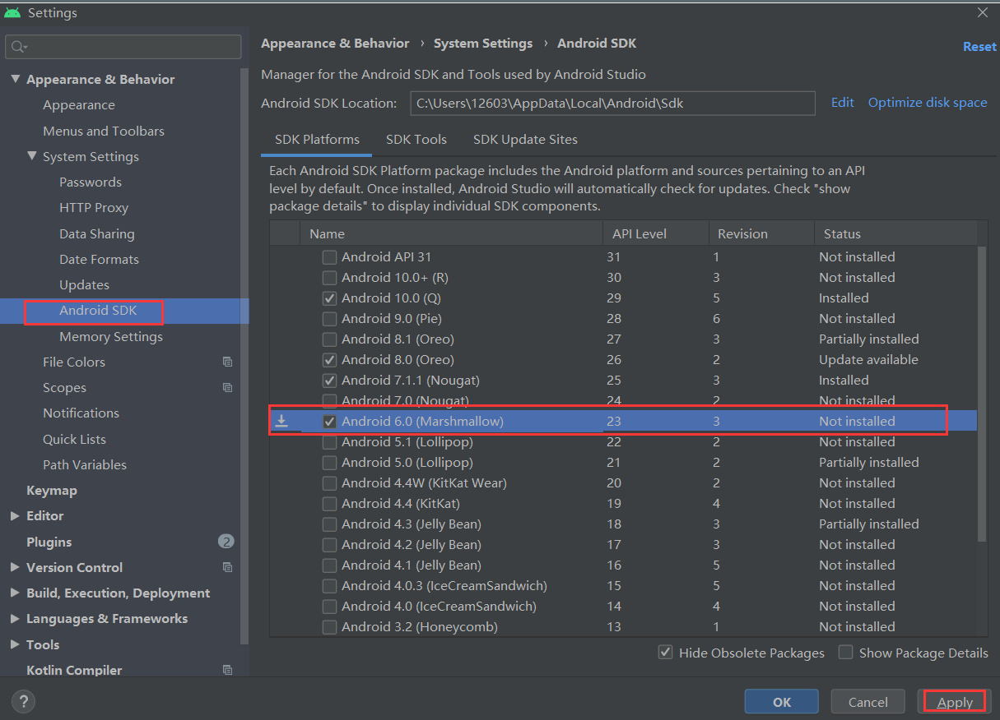

下载完成后，我们只需要将编译器重新关闭，再次打开即可

其他的问题只需要按照编译器提示的缺失文件，点击安装，静静等待配置就可以了，详细的错误解决也可以参考肉丝的博客（一）

然后我们点击`build下Make Project或Rebuild Project`就可以编译成功了，生成路径`build/outputs/apk/app-release-unsigned.apk`

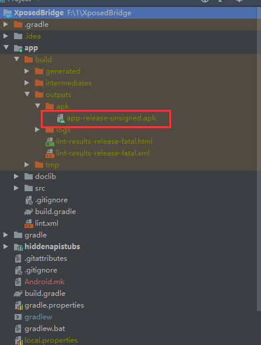

这里就编译生成不签名的apk，然后我们可以把apk重命名XposedBridge.jar

**编译模块开发api.jar**

如果我们需要提供给app调用的api，那么我们可以需要执行android studio的gradle project的other中的generateAPI选项，会在目录build/api中生成apk.jar

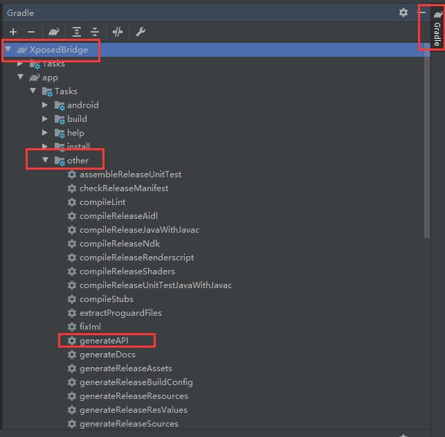

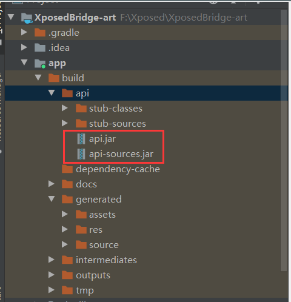

这里的api-sources.jar和XposedBridge中的就是一样的

我们在这里就可以获得XposedBridge.jar和api.jar

#### （3）路径存放

我们android studio产生的XposedBridge.jar就可以放置在/out/target/product/hammerhead/system/framework/文件夹下，而mmm编译的自动存防在该路径下，就不需要管


### 4.android_art和Xposed

#### （1）源码下载

我们从Xposed官网下载`android_art`和`Xposed`源码，我们这里是android6.0，因此下载Xposed_sdk23，参考地址：[Xposed官网地址](https://github.com/rovo89)

```
xposed文件夹包括xposed修改之后的app_process等应用程序和libxposed_*.so等库文件的源码；art文件夹主要包括xposed修改之后的art虚拟机的文件。
```

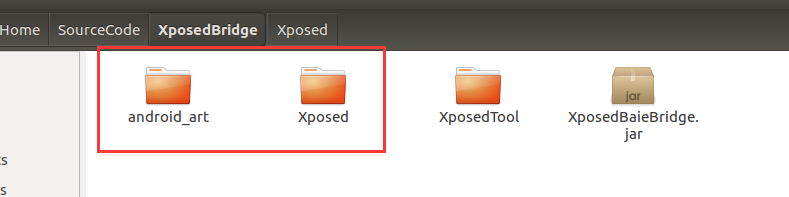

#### （2）android_art

我们将我们下载的android_art文件夹重命名为art文件夹，然后替换android源码下的art文件夹，这就相当于替换了android系统的虚拟机

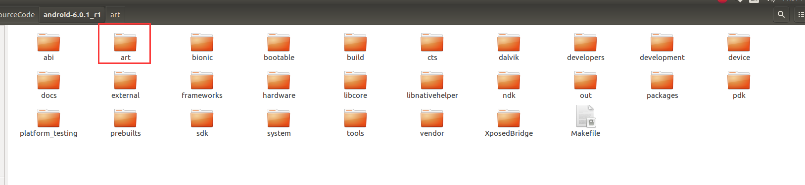

#### （3）xposed

将下载的xposed文件夹移动到`/SourceCode/Android-6.0.1_r1/frameworks/base/cmds/`文件夹下

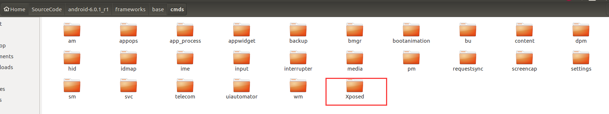

注：这里我们注意下载的Xposed的首字母为大写，我们需要改成xposed，不然后面会报错，具体我们在错误专区中介绍

### 5.XposedTools

#### （1）源码下载

我们从官网上下载XposedTools，官网地址：[XposedTools](https://github.com/rovo89/XposedTools)

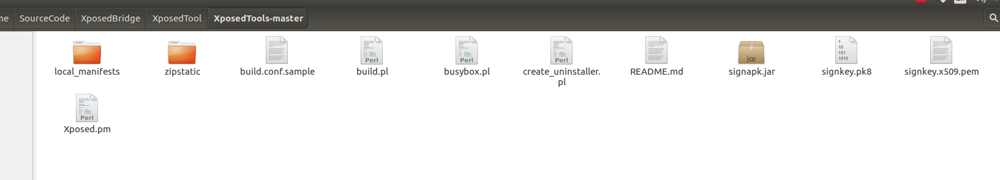

#### （2）build.conf文件配置

```
	build.conf文件是一个配置文件，会被build.pl读取使用。build文件中主要定义了编译xposed的结果的存放路径，android源码的路径，还有一些版本信息之类的值。
将下载的zip包解压，在文件夹下创建build.conf文件
```

```
[General]
outdir = /home/tom/SourceCode/XposedBridge
[Build]
version = 65(custom build by author )
makeflags = -j4
[AospDir]
23 =/home/tom/SourceCode/android-6.0.1_r1
```

```java
outdir指向的路径是xposed编译之后生成的文件的存放路径。
version的值和后边的参数是自己设置的。编译之后会写入到xposed.prop文件中，后面会显示在我们的XposedInstaller中
makeflags是设置在后边编译过程中使用的线程数。
AospDir指向的路径是android源码存放的路径，前边的值是源码对应的SDK的版本号。这里我指向的是android6.0.1的源码，对应的android sdk的版本是23。
```

我们还需要在outdir目录下创建一个java文件夹，然后将上面生成的XposedBridge.jar放到java文件夹下

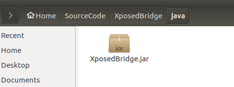

#### （3）build.pl编译Xposed源码

build.pl文件在xposed tools文件夹下，在文件中有对build.pl文件的参数的设置规则等信息

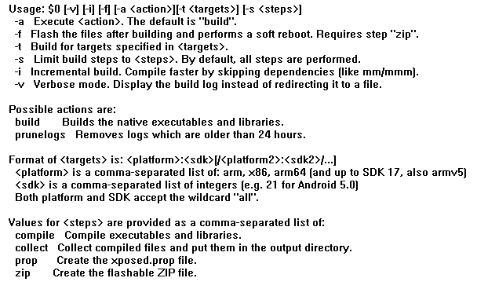

```
	从上图可以看到build.pl主要可以完成的工作有四个，分别是编译生成xposed的可执行程序和库文件，将编译之后的文件拷贝到配置文件指定的输出路径下，创建xposed.prop文件，创建flashable ZIP文件。在参数中可以使用-t 针对指定的目标进行创建,在xposed tools目录下运行
```

```
./build.pl -t arm:23
```

然后报错，这个是我们缺失依赖包

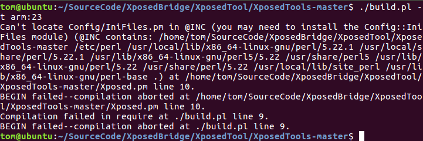

  build arm files for SDK23(对应的是Android6.0系统)  在执行过程中，可能会提示缺少一些依赖包，例如可能会缺少Config::IniFiles，使用apt-cache search  Config::IniFiles搜索，安装缺少的包即可

**安装Config::IniFiles**

先安装perl环境

```
apt-cache search Config::IniFiles
sudo apt install libconfig-inifiles-perl
```

然后我们再安装Config::IniFiles

```java
sudo perl -MCPAN -e 'install Config::IniFiles'
sudo perl -MCPAN -e 'install File::Tail'
sudo perl -MCPAN -e 'install File::ReadBackwards'
```

这里我们就安装了缺失的环境，然后我们再次编译

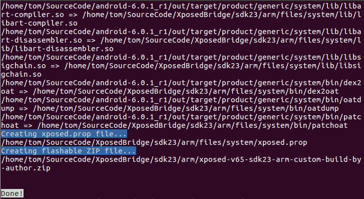

#### （4）生成编译结果

build.pl -t运行结束之后，会将生成的xposed的可执行程序和so库等文件放入到build.conf配置文件中指定的输出目录下。包括lib文件夹下的五个so库和bin文件加下的四个可执行程序以及一个配置文件。

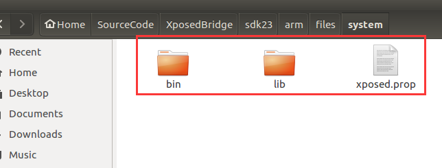

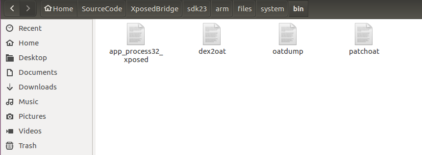

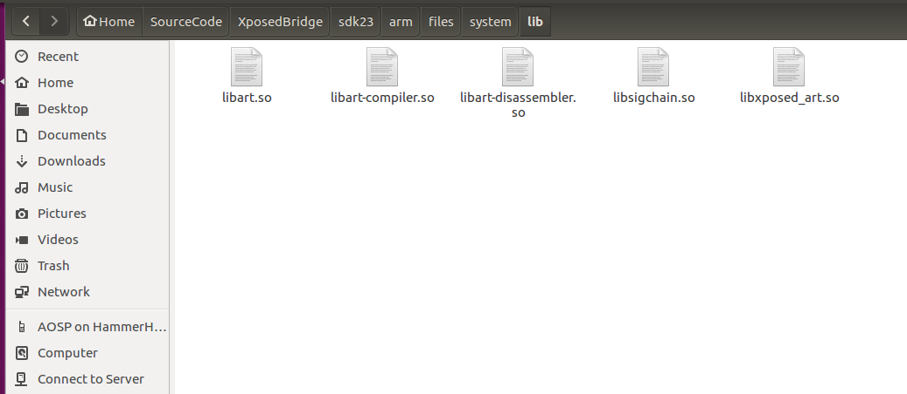

我们还可以发现sdk23下生成xposed-v65-sdk23-arm-custom-build-by-author.zip，这就是我们下载的xposed压缩文件

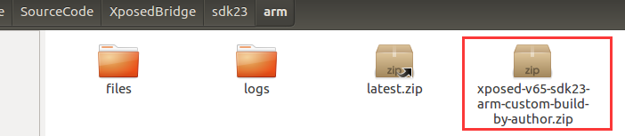

我们可以看一下Xposed框架压缩文件与SDK的匹配关系，下载的参考网址：[Xposedsdk](https://dl-xda.xposed.info/framework/)（图片来源：[学习篇-xposed框架及高版本替代方案](https://bbs.pediy.com/thread-264160.htm)）

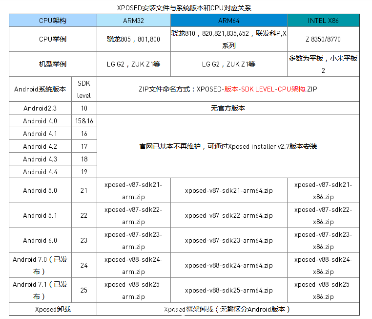

### 6.XposedInstaller

#### （1）源码下载

我们从官网上下载XposedInstaller，官网地址：[XposedInstaller](https://github.com/rovo89/XposedInstaller)

#### （2）源码编译

我们直接通过Android Studio打开源码，进行环境配置，然后开始编译，生成XposedInstaller.apk即可

### 7.源码编译

#### （1）替换

用编译生成的bin文件夹中文件替换/out/target/product/hammerhead/system/文件夹下的bin文件夹中文件，进入bin文件夹下

```
cp /home/tom/SourceCode/XposedBridge/sdk23/arm/files/system/bin/* .
```

注意的是用xposed编译生成的app_process32_xposed替换system/bin文件夹下的app_process32

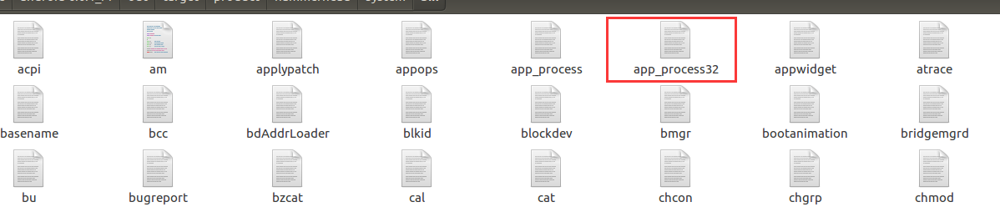

用编译生成的lib文件夹中文件替换/out/target/product/hammerhead/system/文件夹下的lib文件夹中文件，我们进入lib文件夹下

```
cp /home/tom/SourceCode/XposedBridge/sdk23/arm/files/system/lib/* .
```

在/out/target/product/hammerhead/system/文件夹下加入编译生成的xposed.prop，我们进入system文件夹下

```java
 cp /home/tom/SourceCode/XposedBridge/sdk23/arm/files/system/xppsed.prop  .
```

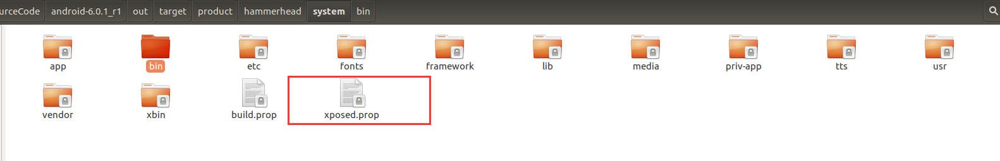

#### （2）重新生成镜像文件

我们进入android源码的根目录下：

```
source build/envsetup.sh
lunch 19
make snod  //make snod命令的作用是重新生成镜像文件system.img
```

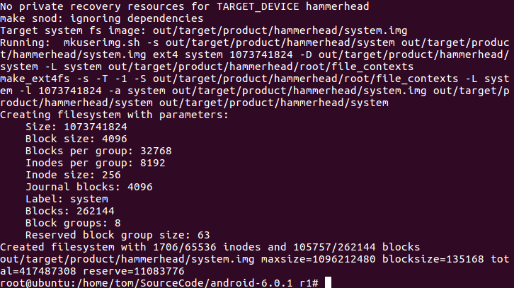

#### （3）刷机

然后我们只需要将system.img镜像刷入即可

```
fastboot flash system system.img
```

然后我们需要获取root权限

我们先刷入twrp:

```
fastboot flash recovery twrp-2.8.7.1-hammerhead.img 
```

然后我们将SuperSU推送到手机中

```
adb push SR5-SuperSU-v2.82-SR5-20171001224502.zip /sdcard
```

然后我们进入recovery模式：

将SuperSU刷入，直接通过进行刷入即可，这样手机就获得root权限了，然后重启手机

### 8.结果与测试

#### （1）结果

我们打开手机，并输入命令抓取日志：

```
adb logcat | grep -i xposed
```


这是我们还没有安装XposedInstall.apk，然后我们安装上XposedInstaller.apk，然后重启

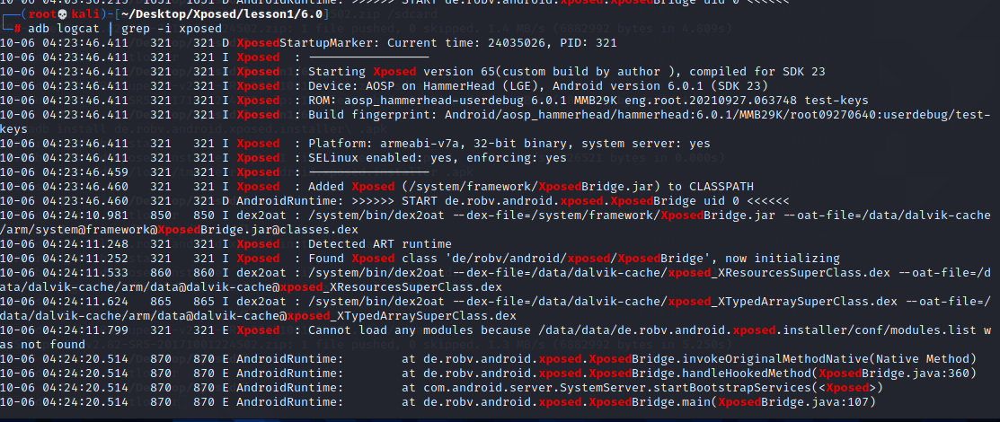


我们就可以发现Xposed框架成功激活

#### （2）测试

我们导入模块来测试我们的Xposed框架是否能使用

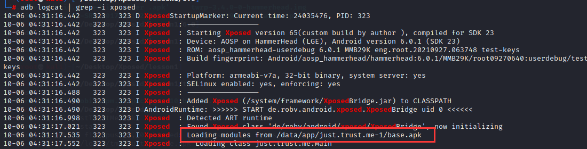

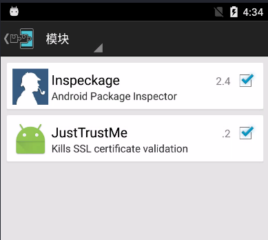

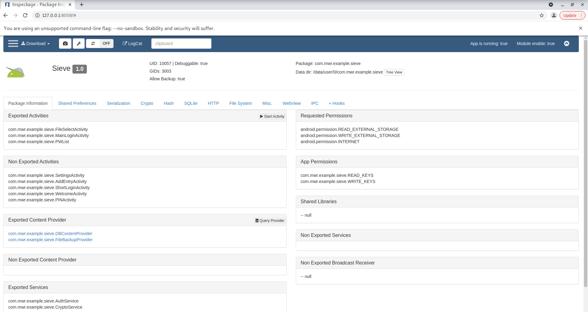

经过测试我们编译的Xposed框架是可以正常使用的

### 9.错误解决

#### （1）错误1

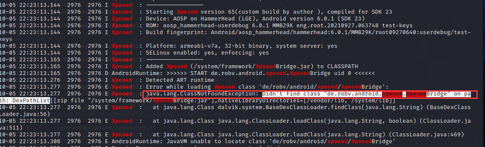

问题分析：

这是在使用mmm直接编译模块时，Android.mk文件编写错误，导致没有打包`de.robv.android.xposed.XposedBridge`该类


问题解决：

这里我们应该在Android.mk中注意编写导入文件，更加推荐使用AndroidStudio直接编译，这样出错概率较少

#### （2）错误2

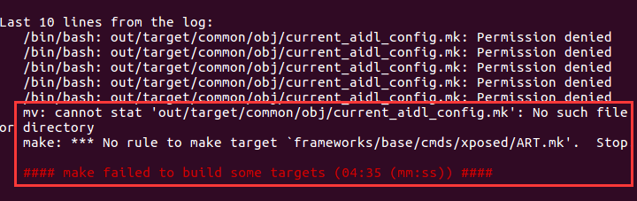

问题分析：

这里是因为我们下载的Xposed首字母大写

问题解决：

我们需要注意大小写问题

#### （3）错误3

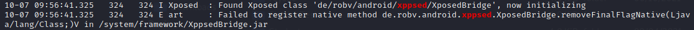

问题分析：

这是由于XposedBridge版本和XposedInstaller版本不一致导致的，我们进入源码发现该XposedBridge中函数并不包含此类，我们需要选择更高版本的源码

问题解决：

此类问题注意XposedBridge和XposedInstaller版本不一致的问题，需要采用合适的Xposed版本源码

## 三、实验总结

在Xposed源码编译过程中，出现了很多的问题，但是大部分问题通过查找对应的错误，分析源码基本都可以解决，其中很多问题大部分是由于你下载的XposedBridge源码和XposedInstaller源码不匹配引起的，而还有一部分原因是因为你生的XposedBridge.jar错误引起的，在我们激活Xposed框架时，我们最好使用`adb logcat | grep "xposed"`来观察运行的情况，很多错误的操作可能导致Xposed框架不能正常的激活，从而导致手机死机，启动不了，这个时候我们可以进入recovery模式，wipe清除数据，这里实际上是清除XposedInstaller.apk，使得xposed不会被激活，手机就可以正常的进入，但是我们还是要通过日志信息分析原因，只要找到问题，重新编译源码，我们就可以正常启动了

实验所用的文件资料，后续都会上传到github上：[github地址](https://github.com/guoxuaa/Android-reverse/tree/main/Android%E6%BA%90%E7%A0%81%E5%AE%9A%E5%88%B6)

## 四、参考文献

```java
https://www.jianshu.com/p/6471bab49cb1
https://juejin.cn/post/6844903711714574344
https://juejin.cn/post/6844903709730668551
https://v2as.com/article/490aeab6-c2e2-4e28-a341-457ede3d7711
https://www.hellojava.com/a/78058.html
https://flysands.github.io/blog/2017-12-25-%E7%BC%96%E8%AF%91xposed%E6%BA%90%E7%A0%81.html
https://mp.weixin.qq.com/s/c97zoTxRrEeYLvD8YwIUVQ
```


