# 源码编译（3）——Xposed源码定制

[TOC]


## 一、前言

在上篇文章[源码编译（2）——Xopsed源码编译详解](https://bbs.pediy.com/thread-269616.htm)中详细介绍了Xposed源码编译的完整过程，本文将从Android编译过程到Xposed运行机制，最后进行Xposed框架的详细定制。其中Xposed的定制主要参考世界美景大佬的[定制Xposed框架](https://bbs.pediy.com/thread-255836.htm)和肉丝大佬的[来自高纬的对抗：魔改XPOSED过框架检测(下)](https://mp.weixin.qq.com/s/YAMCrQSi0LFJGNIwB9qHDA)。

**致谢：**

首先感谢世界美景大佬的[定制Xposed框架](https://bbs.pediy.com/thread-255836.htm)，从里面学习到对Xposed框架特征的修改，但是由于个人水平有限，大佬的贴子不够详细，不能完整复现，经过搜索发现肉丝大佬的基于此的两篇详细的贴子讲解：[来自高纬的对抗：魔改XPOSED过框架检测(上)](https://mp.weixin.qq.com/s/c97zoTxRrEeYLvD8YwIUVQ)和[来自高纬的对抗：魔改XPOSED过框架检测(下)](https://mp.weixin.qq.com/s/YAMCrQSi0LFJGNIwB9qHDA)，本文的Android系统运行参考[老罗的博客](https://www.kancloud.cn/alex_wsc/androids/472168)

## 二、Android运行机制

我们在了解Xposed的运行机制前，不得不需要了解Android系统的基本结构和运行机制，这样我们才能进一步学习如何进行Xposed定制，才能减少更多的错误

### 1. Android平台架构

Android的平台架构如下图所示：

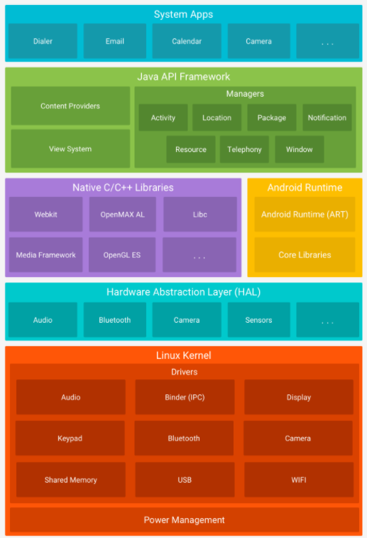

下面我们依次介绍各层之间的功能和作用：

#### （1）Linux内核

Android平台的基础是linux内核，Android Runtime（ART）依靠Linux内核来执行底层功能，使用Linux内核可让Android利用主要安全功能，并且运行设备制造商为著名的内核开发硬件驱动程序，可以理解基于linux内核让Android更安全并且可以拥有很多设备驱动

#### （2）硬件抽象层（HAL）

HAL提供标准界面，向更高级别Java API框架显示设备硬件功能，HAL包含多个模块，其中每个模块都为特定类型的硬件组件实现一个界面，例如相机和蓝牙模块，当框架API要访问设备硬件时，Android系统为该硬件组件加载库模块。

#### （3）Android Runtime

Android 5.0之前Android Runtime为Dalvik，Android 5.0之后Android Runtime为ART

首先我们先了解一些文件的含义：

```java
（1）dex文件：Android将所有的class文件打包形成一个dex文件，是Dalvik运行的程序
（2）odex文件：优化过的dex文件，Apk在安装时会进行验证和优化，通过dexopt生成odex文件，加快Apk的响应时间
（3）oat文件：Android私有ELF文件格式，有dex2oat处理生成，包含（原dex文件+dex翻译的本地机器指令），是ART虚拟机使用的文件，可以直接加载
（4）vdex文件：Android 8.0引入，包含APK的未压缩DEX代码，以及一些旨在加快验证速度的元数据
```

下面我们从Android系统的发展过程中详细介绍二者的区别：

| 版本    | 虚拟机类型 | 特性           |
| ------- | ---------- | -------------- |
| 2.1-4.4 | Dalvik     | JIT+解释器     |
| 5.0-7.0 | ART        | AOT            |
| 7.0-11  | ART        | AOT+JIT+解释器 |

下面部分参考博客：[博客地址](https://juejin.cn/post/6844903748058218509)

**Android 2.2**

**Dalvik**

```
	支持已转换成dex格式的android应用，基于寄存器，指令执行更快，加载的是odex文件，采用JIT运行时编译
```

**JIT:**

```
	JIT即运行时编译策略，可以理解成一种运行时编译器，此时Android的虚拟机使用的是Dalvik，为了加快Dalvik虚拟机解释dex速度，运行时动态地将执行频率很高的dex字节码翻译成本地机器码
缺点：
	（1）每次启动应用都需要重新编译
	（2）运行时比较耗电，造成电池额外的开销
```

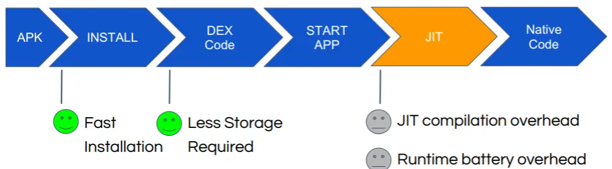


```
	基于Dalvik的虚拟机，在APK安装时会对dex文件进行优化，产生odex文件，然后在启动APP后，运行时会利用JIT即时编译，处理执行频率高的一部分dex，将其翻译成机器码，这样在再次调用的时候就可以直接运行机器码，从而提高了Dalvik翻译的速率，提高运行速度
缺点：
	（1）由于在Dex加载时会触发dexopt , 导致Multidex加载的时候会非常慢
	（2）由于热点代码的Monitor一直在运行 , 解释器解释的字节码会带来CPU和时间的消耗, 会带来电量的损耗
```

**Android 4.4——ART和AOT**

此时引入全新的虚拟机运行环境ART和全新的编译策略AOT，此时ART和Dalvik是共存的，用户可以在两者之间选择

**Android 5.0——ART全面取代Dalvik**

AOT:

```java
AOT是一种运行前编译的策略
缺点：
（1）应用安装和系统升级之后的应用优化比较耗时
（2）优化后的文件会占用额外的存储空间
```

AOT与JIT区别：

```
JIT 是在运行时进行编译，是动态编译，并且每次运行程序的时候都需要对 odex 重新进行编译
AOT 是静态编译，应用在安装的时候会启动 dex2oat 过程把 dex 预编译成 ELF 文件，每次运行程序的时候不用重新编译，是真正意义上的本地应用
```

JVM、Dalvik和ART区别：

```
JVM：传统的Java虚拟机、基于栈、运行class文件
Dalvik:支持已转换成dex格式的android应用，基于寄存器，指令执行更快,加载的是odex（优化的dex）
ART:第一次安装时，将dex进行Aot(预编译)，字节码预先编译成机器码，生成可执行oat文件（ELF文件）
```

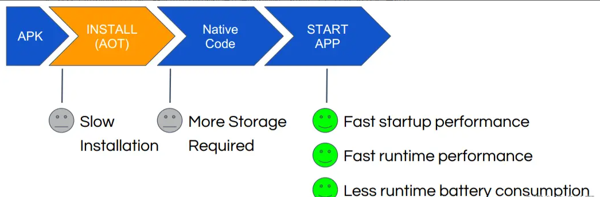


```java
	基于ART的虚拟机，会在APK第一次安装时，将dex进行AOT(预编译)，通过dex2oat生成oat文件，即Android可执行ELF文件，包括原dex文件和翻译后的机器码，然后启动程序后，直接运行
缺点：
    （1）由于安装APK时触发dex2oat , 需要编译成native code , 导致安装时间过长
    （2）由于dex2oat生成的文件较大 , 会占用较多的空间
```

**Android 7.0——JIT回归**

考虑上面AOT的缺点，dex2oat过程比较耗时且会占用额外的存储空间，Android 7.0 再次加入JIT形成`AOT+JIT+解释器`模式

特点：

```
（1）应用在安装的时候 dex 不会被编译
（2）应用在运行时 dex 文件先通过解析器（Interpreter）后会被直接执行，与此同时，热点函数（Hot Code）会被识别并被 JIT 编译后存储在 jit code cache 中并生成 profile 文件以记录热点函数的信息
（3）手机进入 IDLE（空闲） 或者 Charging（充电） 状态的时候，系统会扫描 App 目录下的 profile 文件并执行 AOT 过程进行编译
```

混合编译模式综合了 AOT 和 JIT 的各种优点，使得应用在安装速度加快的同时，运行速度、存储空间和耗电量等指标都得到了优化

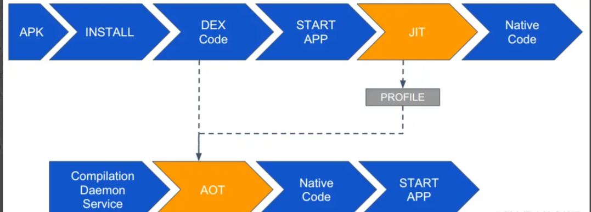

最后我们可以看下Android各版本ClassLoader加载dex时的dexopt过程：

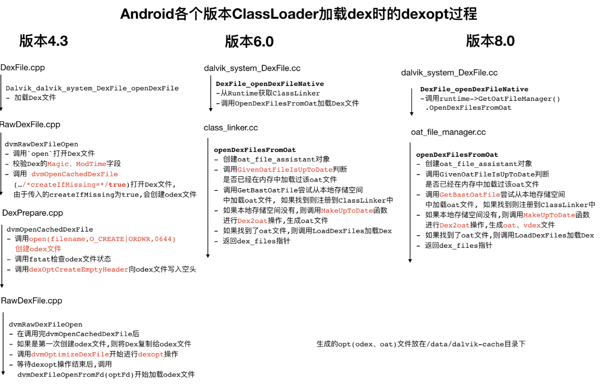

#### （4）原生C/C++库

许多核心 Android 系统组件和服务（例如 ART 和 HAL）构建自原生代码，需要以 C 和 C++ 编写的原生库。Android 平台提供 Java 框架 API 以向应用显示其中部分原生库的功能，我们可以通过NDK开发Android中的C/C++库

#### （5）Java API框架

通过以 Java 语言编写的 API 使用 Android OS 的整个功能集。这些 API 形成创建 Android 应用所需的构建块，它们可简化核心模块化系统组件和服务的重复使用，包括以下组件和服务

### 2. Android启动流程

Android启动流程如下图所示：

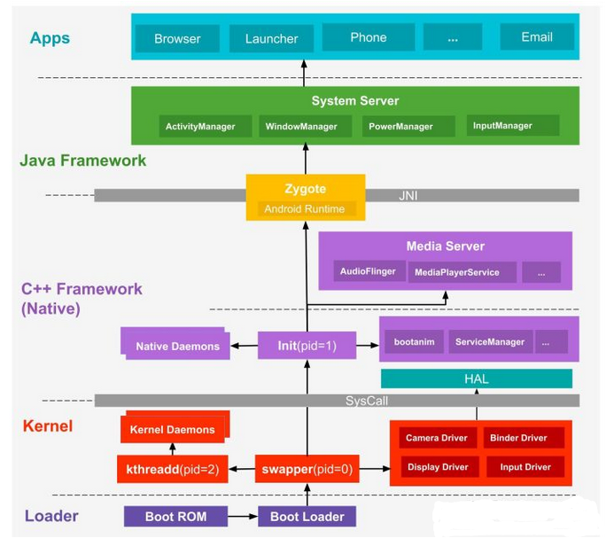

#### （1）Loader

```
Boot ROM: 当手机处于关机状态时，长按Power键开机，引导芯片开始从固化在ROM里的预设代码开始执行，然后加载引导程序到RAM
Boot Loader：这是启动Android系统之前的引导程序，主要是检查RAM，初始化硬件参数，拉起Android OS
```

我们长按电源键后，手机就会在Loader层加载引导程序，并启动引导程序，初始化参数

#### （2）Linux内核

```java
(1)启动Kernel的swapper进程(pid=0)：该进程又称为idle进程, 系统初始化过程Kernel由无到有开创的第一个进程, 用于初始化进程管理、内存管理，加载Display,Camera Driver，Binder Driver等相关工作，这些模块驱动都会封装到对应的HAL层中
(2)启动 init 进程（用户进程的祖宗）。pid = 1，用来孵化用户空间的守护进程、HAL、开机动画等
(3)启动kthreadd进程（pid=2）：是Linux系统的内核进程，会创建内核工作线程kworkder，软中断线程ksoftirqd，thermal等内核守护进程。kthreadd进程是所有内核进程的鼻祖	
```

#### （3）执行init进程

init 进程是Linux系统中用户空间的第一个进程，进程号为1，是所以用户进程的祖先

Linux Kernel完成系统设置后，会首先在系统中寻找init.rc文件，并启动init进程，init.rc脚本存放路径：` /system/core/rootdir/init.rc` ，init进程：`/system/core/init `

init进程的启动可以分为三个部分：

```java
（1）init进程会孵化出ueventd、logd、healthd、installd、adbd、lm这里写代码片kd等用户守护进程
（2）init进程还会启动ServiceManager(Binder服务管家)、bootanim(开机动画)等重要服务
（3）解析init.rc配置文件并孵化zygote进程,Zygote进程是Android系统的第一个java进程（虚拟机进程），zygote进程是所以Java进程的父进程
```

创建Zygote过程：

```java
（1）解析 init.zygote.rc //parse_service() 
（2）启动 main 类型服务 //do_class_start() 
（3）启动 zygote 服务 //service_start() 
（4）创建 Zygote 进程 //fork() 
（5）创建 Zygote Socket //create_socket()
```

#### （4）Zygote

Zygote为孵化器，即所有Android应用的祖先，Zygote 让 VM 共享代码、低内存占用以及最小的启动时间成为可能， Zygote 是一个虚拟机进程，Zygote是由init进程通过解析`init.zygote.rc`文件而创建的，zygote所对应的可执行程序`app_process`，所对应的源文件是`App_main.cpp`，进程名为zygote

Zygote作用过程：

```java
(1)解析init.zygote.rc中的参数，创建AppRuntime并调用AppRuntime.start()方法；
(2)调用AndroidRuntime的startVM()方法创建虚拟机，再调用startReg()注册JNI函数；
(3)通过JNI方式调用ZygoteInit.main()，第一次进入Java世界；
(4)registerZygoteSocket()建立socket通道，zygote作为通信的服务端，用于响应客户端请求；
(5)preload()预加载通用类、drawable和color资源、openGL以及共享库以及WebView，用于提高app启动效率；
(6)zygote完毕大部分工作，接下来再通过startSystemServer()，fork得力帮手system_server进程，也是上层framework的运行载体。
(7)zygote功成身退，调用runSelectLoop()（死循环），随时待命，当接收到请求创建新进程请求时立即唤醒并执行相应工作。
```

Android系统流程总结：

```java
(1) 手机开机后，引导芯片启动，引导芯片开始从固化在ROM里的预设代码执行，加载引导程序到到RAM，BootLoader检查RAM，初始化硬件参数等功能；
(2) 硬件等参数初始化完成后，进入到Kernel层，Kernel层主要加载一些硬件设备驱动，初始化进程管理等操作。在Kernel中首先启动swapper进程（pid=0），用于初始化进程管理、内管管理、加载Driver等操作，再启动kthread进程(pid=2),这些linux系统的内核进程，kthread是所有内核进程的鼻祖；
(3) Kernel层加载完毕后，硬件设备驱动与HAL层进行交互。初始化进程管理等操作会启动init进程 ，这些在Native层中；
(4) init进程(pid=1，init进程是所有进程的鼻祖，第一个启动)启动后，会启动adbd，logd等用户守护进程，并且会启动servicemanager(binder服务管家)等重要服务，同时孵化出zygote进程，这里属于C++ Framework，代码为C++程序；
(5) zygote进程是由init进程解析init.rc文件后fork生成，它会加载虚拟机，启动System Server(zygote孵化的第一个进程)；SystemServer负责启动和管理整个Java Framework，包含ActivityManager，WindowManager，PackageManager，PowerManager等服务；
(6) zygote同时会启动相关的APP进程，它启动的第一个APP进程为Launcher，然后启动Email，SMS等进程，所有的APP进程都有zygote fork生成。
```

## 三、Xposed框架运行机制

我们从上文中已经详细介绍了Android的启动流程，如下图所示：

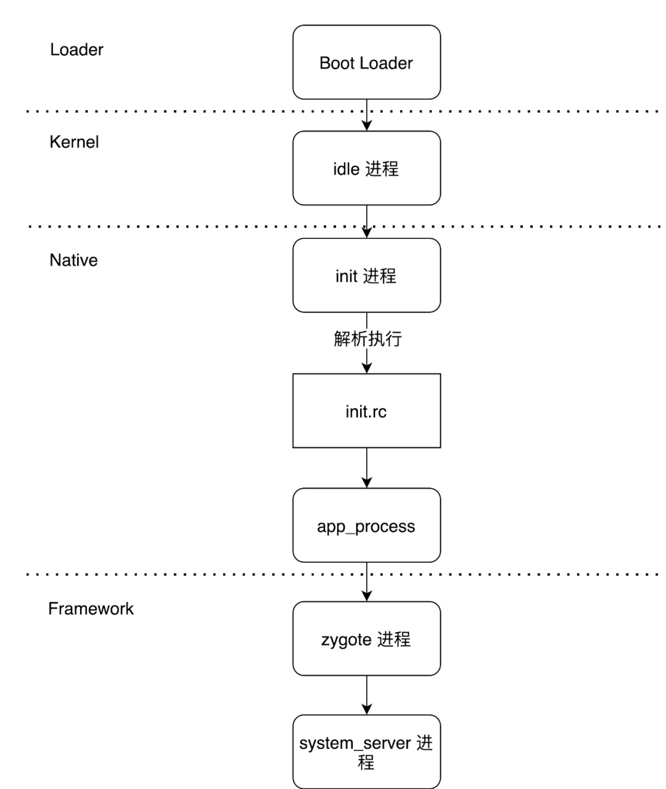

下面我们来详细介绍Xposed框架的实现原理：

### 1.  Xposed实现原理

我们先进入[Xposed官网](https://github.com/rovo89)，可以发现Xposed工程的5个文件夹：


具体的模块功能和作用，我们在上文[源码编译（2）——Xopsed源码编译详解](https://bbs.pediy.com/thread-269616.htm)已经介绍了，大家可以去参考

上文中我们知道，Xposed集成到Android源码中主要是：

```
（1）替换了Android中的虚拟机art
（2）替换了app_process以及生成的一些lib，bin文件等
```

具体如下图所示

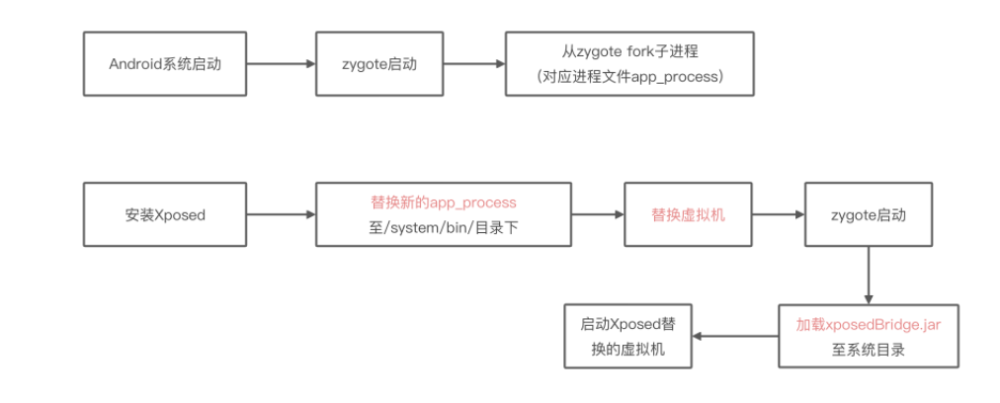

我们从上文中可以得知Android所有的用户进程都是通过Zygote孵化出来的，而Zygote的执行程序是app_process，安装Xposed，将app_process替换，然后替换对应的虚拟机，这样Zygote孵化器就变成了Xposed孵化器


我们先来分析一下替换后的`app_process`：

```java
ifeq (1,$(strip $(shell expr $(PLATFORM_SDK_VERSION) \>= 21)))
  LOCAL_SRC_FILES := app_main2.cpp
  LOCAL_MULTILIB := both
  LOCAL_MODULE_STEM_32 := app_process32_xposed
  LOCAL_MODULE_STEM_64 := app_process64_xposed
else
  LOCAL_SRC_FILES := app_main.cpp
  LOCAL_MODULE_STEM := app_process_xposed
endif
...
ifeq (1,$(strip $(shell expr $(PLATFORM_SDK_VERSION) \>= 21)))
  include frameworks/base/cmds/xposed/ART.mk
else
  include frameworks/base/cmds/xposed/Dalvik.mk
endif
```

程序通过判断`SDK`的版本选择加载文件，这里我们是在Android 6.0上运行，SDK版本为23，因此`app_process`会执行`app_main2.cpp`和`ART.mk`

为了方便我们分析，这里我画了一个思维导图方便大家结合后面源码分析：

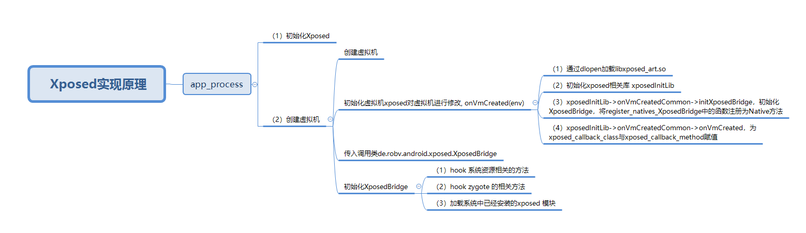

我们再分析app_main2.cpp中main函数：

```c
int main(int argc, char* const argv[])
{
    if (xposed::handleOptions(argc, argv))
        return 0;
    //代码省略...
    runtime.mParentDir = parentDir;
    // 初始化xposed，主要是将jar包添加至Classpath中
    isXposedLoaded = xposed::initialize(zygote, startSystemServer, className, argc, argv);
    if (zygote) {
        // 如果xposed初始化成功，将zygoteInit 替换为 de.robv.android.xposed.XposedBridge，然后创建虚拟机
        runtime.start(isXposedLoaded ? XPOSED_CLASS_DOTS_ZYGOTE : "com.android.internal.os.ZygoteInit",
                startSystemServer ? "start-system-server" : "");
    }
    ...
}
```

```java
main函数主要做了两件事：
(1)初始化xposed
(2)创建虚拟机
```

**初始化xposed：**

```java
bool initialize(bool zygote, bool startSystemServer, const char* className, int argc, char* const argv[]) {
    ...
    // 初始化xposed的相关变量
    xposed->zygote = zygote;
    xposed->startSystemServer = startSystemServer;
    xposed->startClassName = className;
    xposed->xposedVersionInt = xposedVersionInt;
    ...
    // 打印 release、sdk、manufacturer、model、rom、fingerprint、platform相关数据
    printRomInfo();
    // 主要在于将jar包加入Classpath
    return addJarToClasspath();
}
```

```java
（1）初始化xposed内相关变量
（2）调用addJarToClasspath将XposedBridge.jar添加至系统目录
```

**创建虚拟机：**

```java
void AndroidRuntime::start(const char* className, const Vector<String8>& options)
{
    /* start the virtual machine */
    JniInvocation jni_invocation;
    jni_invocation.Init(NULL);
    JNIEnv* env;
    //创建虚拟机
    if (startVm(&mJavaVM, &env) != 0) {
        return;
    }
    // 初始化虚拟机，xposed对虚拟机进行修改
    onVmCreated(env);
    // 虚拟机初始化完成后，会调用传入的de.robv.android.xposed.XposedBridge类，初始化java层XposedBridge.jar
    char* slashClassName = toSlashClassName(className);
    jclass startClass = env->FindClass(slashClassName);
    if (startClass == NULL) {
        ...
    } else {
        jmethodID startMeth = env->GetStaticMethodID(startClass, "main",
        ...
    }
}
```

```java
（1）创建虚拟机
（2）初始化虚拟机xposed对虚拟机进行修改, onVmCreated(env)
（3）传入调用类de.robv.android.xposed.XposedBridge
（4）初始化XposedBridge
```

这里我们可以参考[老罗的源码分析](https://blog.csdn.net/luoshengyang/article/details/8885792):

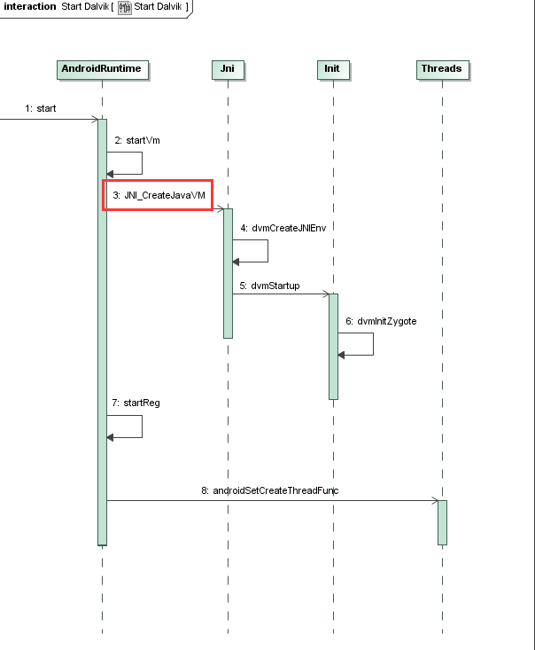

我们可以发现，我们在初始化虚拟机后，xposed会对虚拟机修改，函数`onVmCreated(env)`

**onVmCreated(env):**

```java
void onVmCreated(JNIEnv* env) {
    // Determine the currently active runtime
    if (!determineRuntime(&xposedLibPath)) 
    ...
    // Load the suitable libxposed_*.so for it 通过dlopen加载libxposed_art.so
    void* xposedLibHandle = dlopen(xposedLibPath, RTLD_NOW);
    ...
    // Initialize the library  初始化xposed相关库
    bool (*xposedInitLib)(XposedShared* shared) = NULL;
    *(void **) (&xposedInitLib) = dlsym(xposedLibHandle, "xposedInitLib");
    if (!xposedInitLib)  {
        ALOGE("Could not find function xposedInitLib");
        return;
    }
    ...
    // xposedInitLib -> onVmCreatedCommon -> initXposedBridge -> 注册Xposed相关Native方法
    if (xposedInitLib(xposed)) {
        xposed->onVmCreated(env);
    }
}
```

我们来分析`xposedInitLib`

libxposed_art.cpp#xposedInitLib

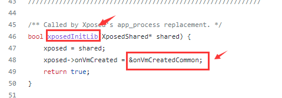

libxposed_common.cpp#onVmCreatedCommon

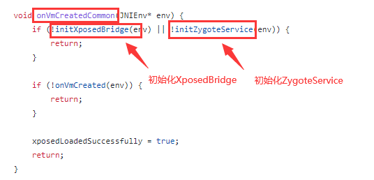

libxposed_common.cpp#initXposedBridge

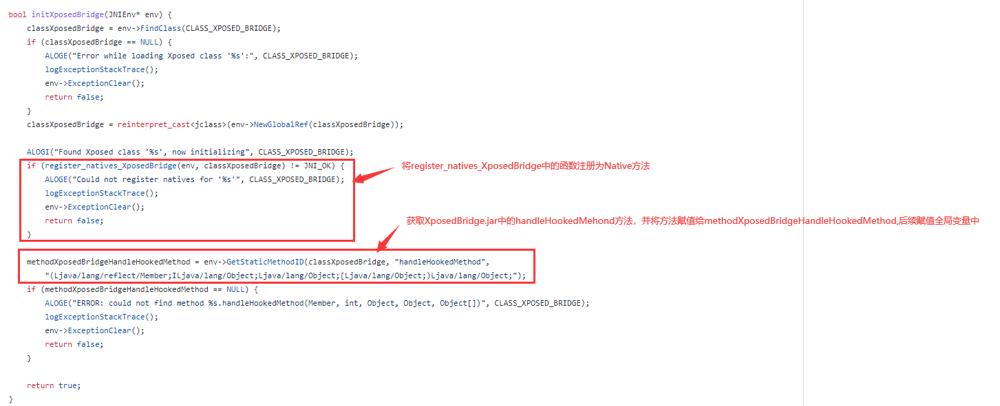

**libxposed_art.cpp#onVmCreated**

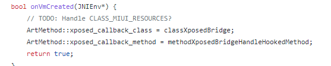

onVmCreated总结：

```java
（1）通过dlopen加载libxposed_art.so
（2）初始化xposed相关库 xposedInitLib
（3）xposedInitLib->onVmCreatedCommon->initXposedBridge，初始化XposedBridge，将register_natives_XposedBridge中的函数注册为Native方法
（4）xposedInitLib->onVmCreatedCommon->onVmCreated，为xposed_callback_class与xposed_callback_method赋值
```

**de.robv.android.xposed.XposedBridge#main**

```java
protected static void main(String[] args) {
        // Initialize the Xposed framework and modules
        try {
            if (!hadInitErrors()) {
                initXResources();
                SELinuxHelper.initOnce();
                SELinuxHelper.initForProcess(null);
                runtime = getRuntime();
                XPOSED_BRIDGE_VERSION = getXposedVersion();
                if (isZygote) {
                    XposedInit.hookResources();
                    XposedInit.initForZygote();
                }
                XposedInit.loadModules();
            } else {
                Log.e(TAG, "Not initializing Xposed because of previous errors");
            }
        } 
        // Call the original startup code
        if (isZygote) {
            ZygoteInit.main(args);
        } else {
            RuntimeInit.main(args);
        }
    }
```

源码分析：

```java
虚拟机初始化完成后，会调用传入的de.robv.android.xposed.XposedBridge类，初始化java层XposedBridge.jar，调用main函数
（1）hook 系统资源相关的方法   XposedInit.hookResources()
（2）hook zygote 的相关方法   XposedInit.initForZygote()
（3）加载系统中已经安装的xposed 模块   XposedInit.loadModules()
```

到此Xposed初始化结束

### 2. Xposed hook原理

通过上文的详细分析，我们可以得出Xposed的hook原理：

```
	Xposed的基本原理是修改了ART/Davilk虚拟机，将需要hook的函数注册为Native层函数。当执行到这一函数是虚拟机会优先执行Native层函数，然后再去执行Java层函数，这样完成函数的hook
```

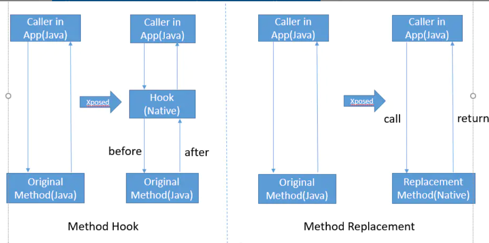

启动过程总结：

```java
（1）手机启动时init进程会启动zygote这个进程。由于zygote进程文件app_process已被替换，所以启动的时Xposed版的zygote进程
（2）Xposed_zygote进程启动后会初始化一些so文件（system/lib system/lib64），然后进入XposedBridge.jar中的XposedBridge.main中初始化jar包完成对一些关键Android系统函数的hook
（3）Hook则是利用修改过的虚拟机将函数注册为native函数
（4）然后再返回zygote中完成原本zygote需要做的工作
```

我们对Xposed的基本原理和hook原理就基本掌握了，大家都知道我们这使用Xposed时，需要不断的去重启手机和勾选我们安装的模块，为了方便使用，这里补充两个技巧，我们了解Xposed源码后，就可以很方便实现了

#### （1）取消重启手机

我们先观察上文XposedBridge中main

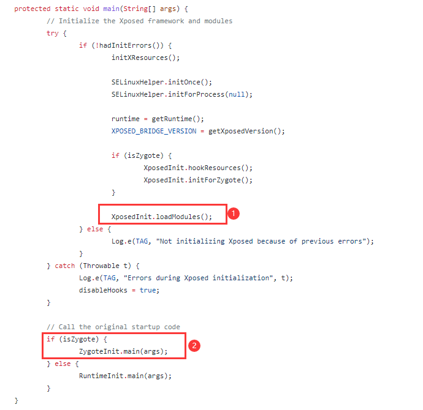

上面的XposedInit.loadModules()这个函数，这个函数的作用就是load hook模块到进程中，因为zygote启动时先跑到java层XposeBridge.main中，在main里面有一步操作是将hook模块load进来，模块加载到zygote进程中，zygote fork所有的app进程里面也有这个hook模块，所以这个模块可以hook任意app。

编写hook模块的第一步就是判断当前的进程名字，如果是要hook的进程就hook，不是则返回，所以修改模块后，要将模块重新load zygote里面必须重启zygote，要想zygote重启就要重启手机了。

解决办法：

```
所以修改的逻辑是不把模块load到zygote里面，而是load到自己想要hook的进程里面，这样修改模块后只需重启该进程即可
```

步骤：

```
（1）将上面XposedInit.loadModules()注释掉即可
（2）在2处修改代码
```

```java
      if (isZygote) {
            XposedHelpers.findAndHookMethod("com.android.internal.os.ZygoteConnection", BOOTCLASSLOADER, "handleChildProc",
                    "com.android.internal.os.ZygoteConnection.Arguments",FileDescriptor[].class,FileDescriptor.class,
                    PrintStream.class,new XC_MethodHook() {

                        @Override
                        protected void afterHookedMethod(MethodHookParam param) throws Throwable {
                            // TODO Auto-generated method stub
                            super.afterHookedMethod(param);
                            String processName = (String) XposedHelpers.getObjectField(param.args[0], "niceName");
                            String coperationAppName = "指定进程名称如：com.android.settings";
                            if(processName != null){
                                if(processName.startsWith(coperationAppName)){
                                    log("--------Begin Load Module-------");
                                    XposedInit.loadModules();
                                }
                            }
                        }

                    });
            ZygoteInit.main(args);
        } else {
            RuntimeInit.main(args);
        }
```

我们只需要将我们的模块进程指定，这样就不用每次开机都重启那

#### （2）取消操作Installer APP

通过阅读源码，我们发现读Install App的源码发现其实勾选hook模块其实app就是把模块的apk位置写到一个文件里，等load模块时会读取这个文件，从这个文件中的apk路径下把apk load到进程中

**loadmodules的源码：**

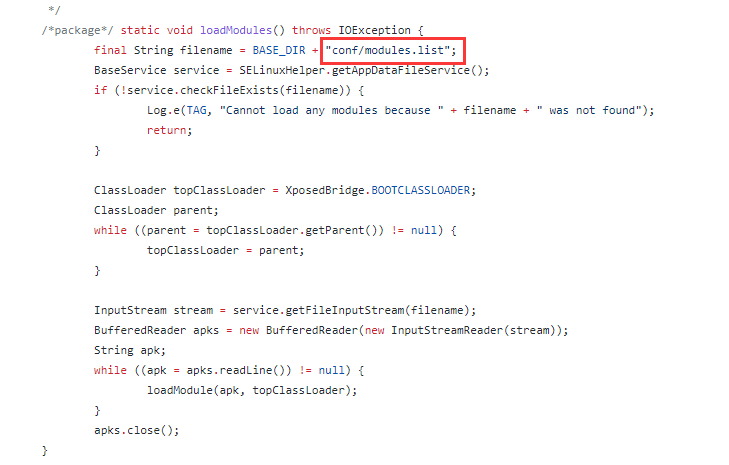

apk配置文件就是installer app文件路径下的`conf/modules.list`这个文件`data/data/de.robv.android.xposed.installer/conf/modules.list`
 或者`data/user_de/0/de.robv.android.xposed.installer/conf/modules.list`

所以我们勾选一个文件，实际是将其写到`conf/modules.list`文件下，此时我们发现Xposed中还有一个方法`loadModule`

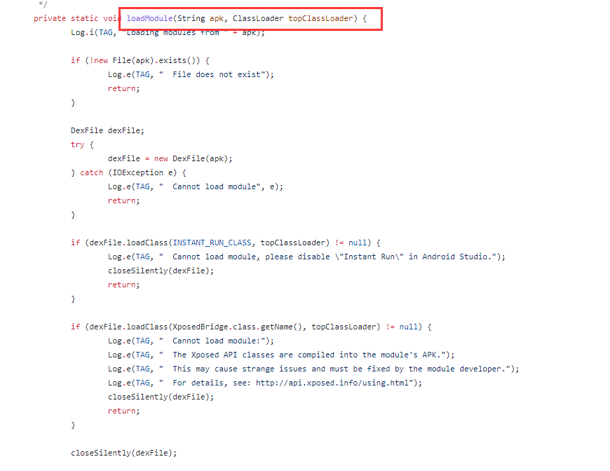

这个方法可以根据具体的路径和类加载器，直接导入模块，所以只要我们在上面代码中修改一些，就可以直接导入，不需要勾选那，我们确定apk路径:`pathclass = "/data/local/tmp/module.apk"`和类加载器为根类加载器

```java
   if (isZygote) {
            XposedHelpers.findAndHookMethod("com.android.internal.os.ZygoteConnection", BOOTCLASSLOADER, "handleChildProc",
                    "com.android.internal.os.ZygoteConnection.Arguments",FileDescriptor[].class,FileDescriptor.class,
                    PrintStream.class,new XC_MethodHook() {

                        @Override
                        protected void afterHookedMethod(MethodHookParam param) throws Throwable {
                            // TODO Auto-generated method stub
                            super.afterHookedMethod(param);
                            String processName = (String) XposedHelpers.getObjectField(param.args[0], "niceName");
                            String coperationAppName = "指定进程名称如：com.android.settings";
                            if(processName != null){
                                if(processName.startsWith(coperationAppName)){
                                    log("--------Begin Load Module-------");
                                    String pathclass = "/data/local/tmp/module.apk";
                                    //注意这里是loadModule方法,类加载器是我们的根类加载器
                                    XposedInit.loadModule(pathclass,BOOTCLASSLOADER);
                                }
                            }
                        }

                    });
            ZygoteInit.main(args);
        } else {
            RuntimeInit.main(args);
        }
```

## 四、Xposed框架特征

本节参考世界美景大佬[定制Xposed框架](https://bbs.pediy.com/thread-255836.htm)和肉丝大佬[来自高纬的对抗：魔改XPOSED过框架检测(下)](https://mp.weixin.qq.com/s/YAMCrQSi0LFJGNIwB9qHDA)，经过我们上文的Android运行机制和Xposed框架运行机制讲解，相信大家对Xposed的框架已经有了进一步的认识，这样我们再来看这篇帖子里的修改的特征，就显得十分清晰了

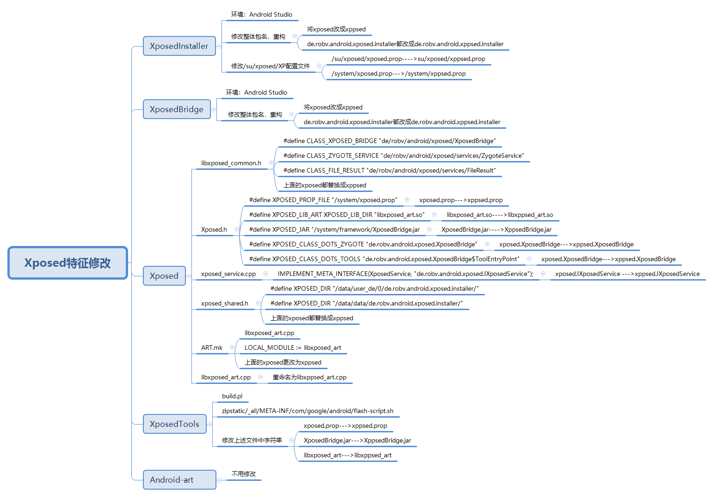

## 五、Xposed特征修改

### 1. XposedInstaller

我们下载XposedInstaller的工程代码加载到AndroidStudio中，让XposedInstaller配置环境，错误提示解决见上文[源码编译（2）——Xopsed源码编译详解](https://bbs.pediy.com/thread-269616.htm)

修改点：

```
（1）修改整体包名
（2）修改xposed.prop
```

#### （1）修改整体包名

先来改下整体的包名，首先将目录折叠给取消掉

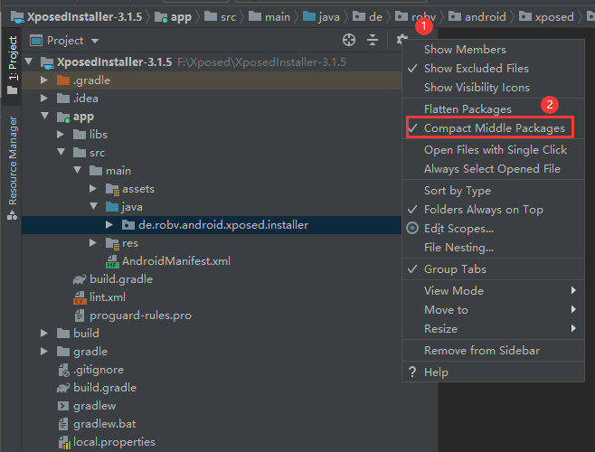

然后我们在包名路径中，将xposed改成xppsed，这样可以保证包名长度是一样，同时xposed特征消失不见，选择Refactor→Rename

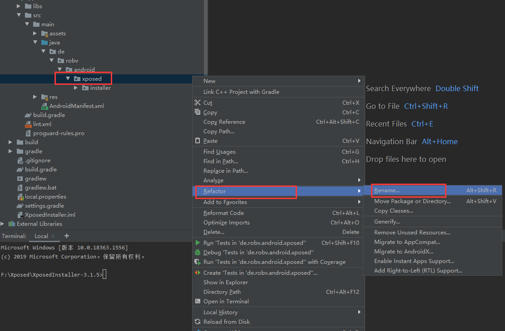

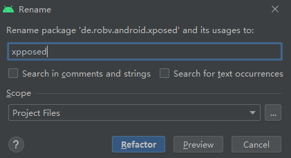

我们直接点击Refactor，就可以替换成功，点击Preview，则需要再点击 Do Refactor 

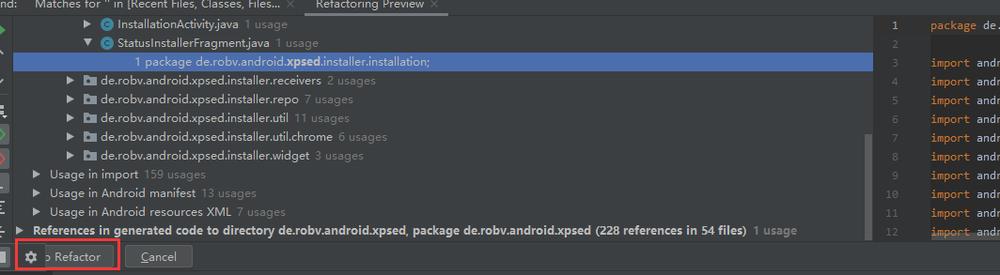

这时候我们可以发现程序下的包名都改变了

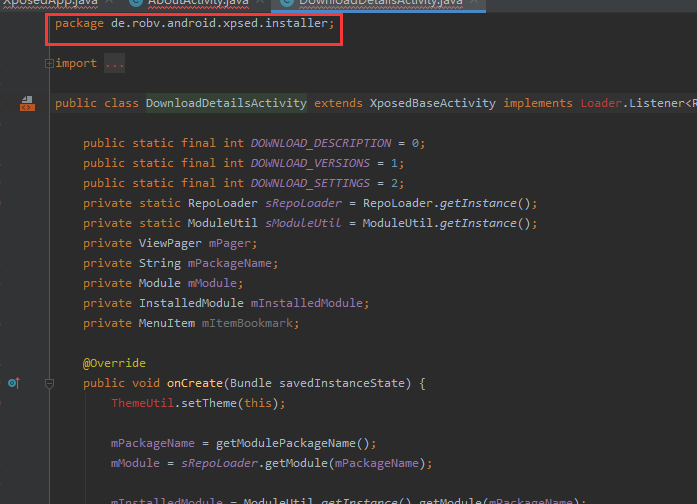

接下来就是在整个项目的根文件夹下，进行整体的包名替换，因为还有很多编译配置、或者路径配置等等，需要进行包名的更换

在app文件夹右击，选择Replace in Path

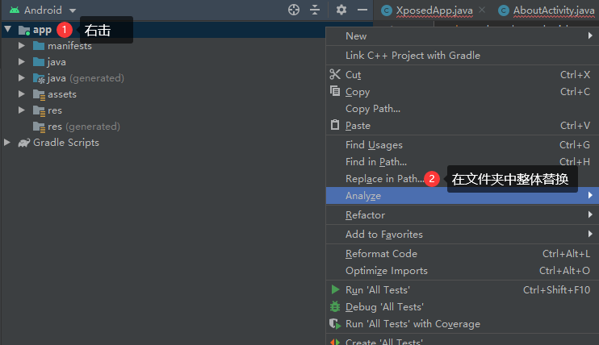

把所有的`de.robv.android.xposed.installe`都改成`de.robv.android.xpsed.installer`

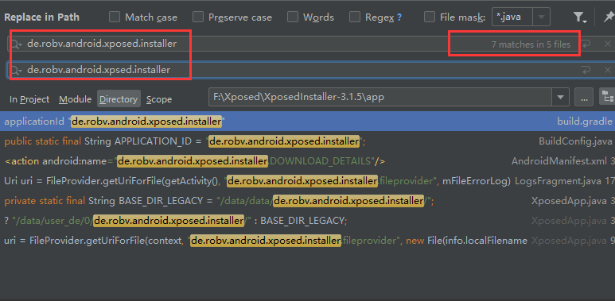

搜出来匹配的地方只有5个文件中合计的7处地方，并不多，直接replace All替换即可

#### （2）`xposed.prop`改成`xpsed.prop`

就是把如下图处的`xposed.prop`改成`xppsed.prop`即可

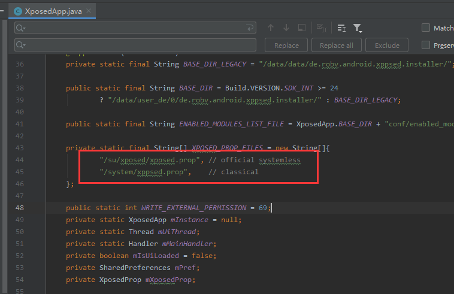

接下来就是编译了。编译时先Build→Clean一下，然后再Build→Make Project，这样就直接编译通过了。可以连接到手机，刷到手机上去，App会被装在手机上，但是无法自动启动，得手动点开

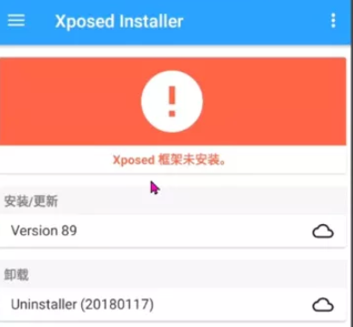

### 2. XposedBridge

#### （1）修改整体包名

首先是改包名，方法与上文一模一样，也是首先将xposed进行重构，改成xppsed

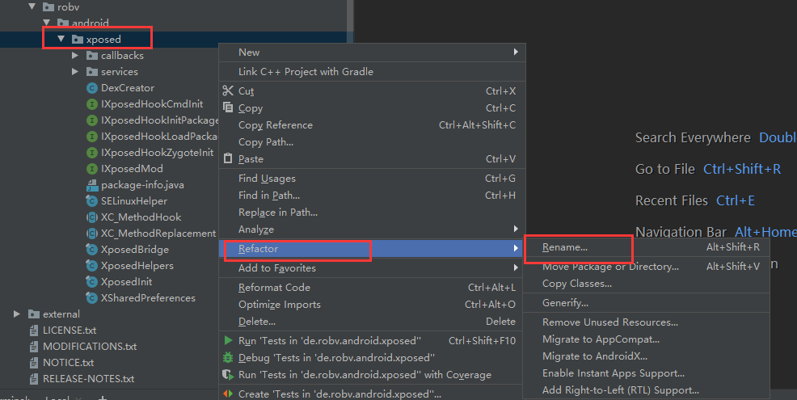

注：我们发现很多类型需要手动修改包名，我们依次将包名修改，这里我们发现重构后没反应，很可能是Android Studio的问题，换一个版本或重启

然后也是一样的在项目根目录下，执行Replace in Path，将所有的`de.robv.android.xposed.installer`都改成`de.robv.android.xppsed.installer`

这里就修改完成

#### （2）生成文件

**XposedBridge.jar:**

先Make Clean一下，然后编译，将编译出来的文件复制一份，命名为XppsedBridge.jar即可

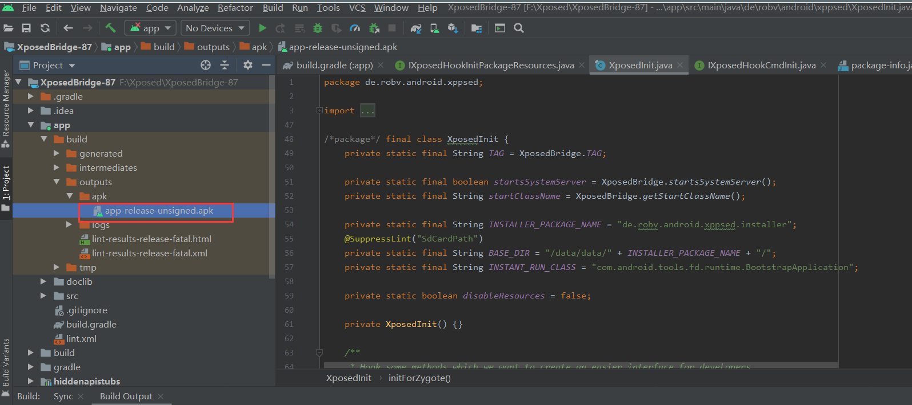

**api.jar:**

然后我们在Gradle->others->generate API中生成api.jar，保存在build/api下

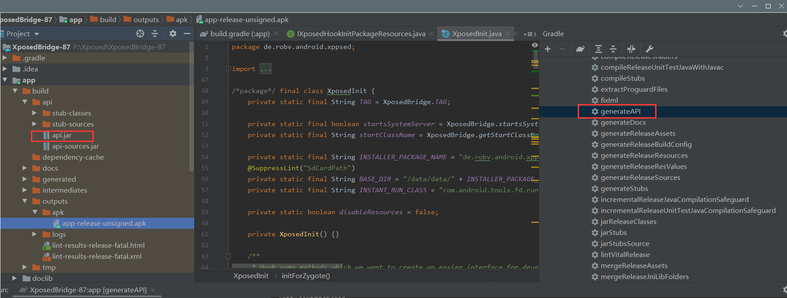

### 3. Xposed

Xposed中的文件需要修改的地方不少：

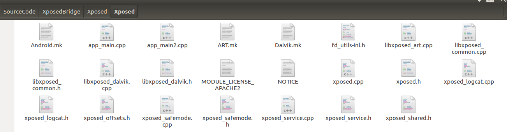

#### （1）libxposed_common.h

修改之前：

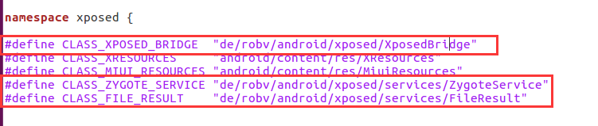

修改之后：

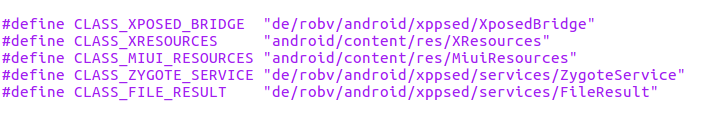

#### （2）Xposed.h

修改之前：

```java
#define XPOSED_PROP_FILE "/system/xposed.prop"
#define XPOSED_LIB_ART XPOSED_LIB_DIR "libxposed_art.so"
#define XPOSED_JAR "/system/framework/XposedBridge.jar"
#define XPOSED_CLASS_DOTS_ZYGOTE "de.robv.android.xposed.XposedBridge"
#define XPOSED_CLASS_DOTS_TOOLS "de.robv.android.xposed.XposedBridge$ToolEntryPoint"
```

修改之后：

```java
#define XPOSED_PROP_FILE "/system/xppsed.prop"
#define XPOSED_LIB_ART XPOSED_LIB_DIR "libxppsed_art.so"
#define XPOSED_JAR "/system/framework/XppsedBridge.jar“
#define XPOSED_CLASS_DOTS_ZYGOTE "de.robv.android.xppsed.XposedBridge"
#define XPOSED_CLASS_DOTS_TOOLS "de.robv.android.xppsed.XposedBridge$ToolEntryPoint"
```

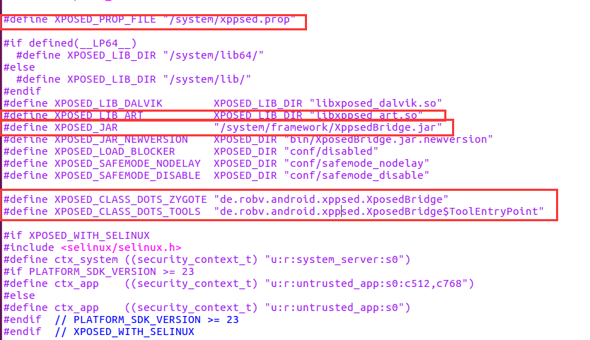

#### （3）xposed_service.cpp

修改之前：

```java
IMPLEMENT_META_INTERFACE(XposedService, "de.robv.android.xposed.IXposedService");
```

修改之后：

```java
IMPLEMENT_META_INTERFACE(XposedService, "de.robv.android.xppsed.IXposedService");
```

#### （4）xposed_shared.h

修改之前：

```java
#define XPOSED_DIR "/data/user_de/0/de.robv.android.xposed.installer/"
#define XPOSED_DIR "/data/data/de.robv.android.xposed.installer/"
```

修改之后：

```java
#define XPOSED_DIR "/data/user_de/0/de.robv.android.xppsed.installer/"
#define XPOSED_DIR "/data/data/de.robv.android.xppsed.installer/"
```

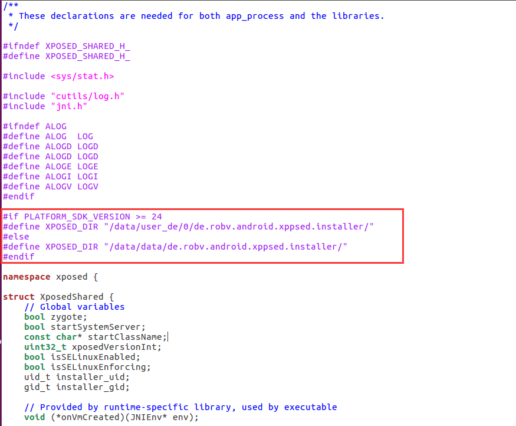

#### （5）ART.mk

修改之前：

```
libxposed_art.cpp
LOCAL_MODULE := libxposed_art
```

修改之后：

```java
libxppsed_art.cpp
LOCAL_MODULE := libxppsed_art
```


#### （6）libxposed_art.cpp

```
将文件夹下的libxposed_art.cpp文件，重命名为libxppsed_art.cpp
```

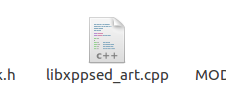

### 4. XposedTools

我们在XposedTools中将`build.pl`和`zipstatic/_all/META-INF/com/google/android/flash-script.sh`的字符替换就可以了

```
xposed.prop--->xppsed.prop
XposedBridge.jar--->XppsedBridge.jar
libxposed_art--->libxppsed_art
```

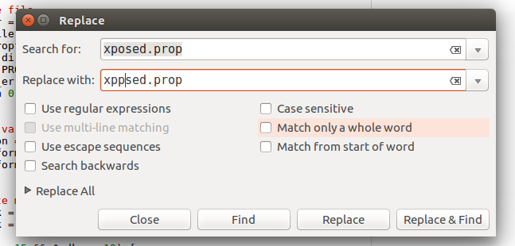

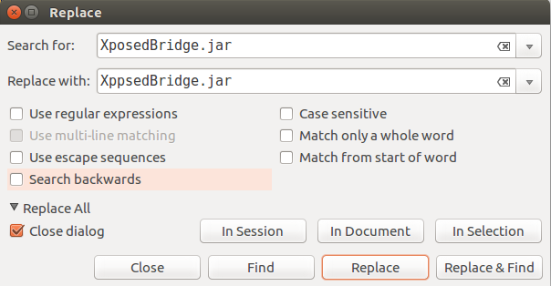

记得不要有遗漏，可以在修改完之后，到根目录下运行下述grep命令试试看，找不到相应的字符串即为全部替换完成

```
grep -ril xposed.prop
grep -ril "xposed.prop" . ##过滤当前目录下含该字符串的文件
```

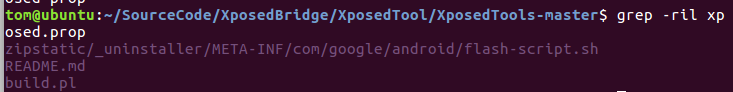

可是明明这里我是替换了的，我进入文件中也查找不到

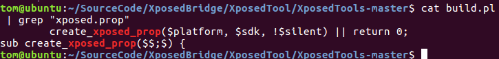

经过分析，我们发现这里会将xposed_prop识别为xposed.prop，说明我们是替换完成了

### 5.源码编译

源码编译流程，详细的参考上文

```
（1）这里我们已经替换了art
（2）记得将修改的xposed替换/SourceCode/Android-6.0.1_r1/frameworks/base/cmds/`文件夹下的xposed文件夹
（3）还记得把编译出来的XppsedBridge.jar放到$AOSP/out/java/目录中去噢，替换旧的XposedBridge.jar
```


我们再次输入编译指令：

```
./build.pl -t arm:23
```

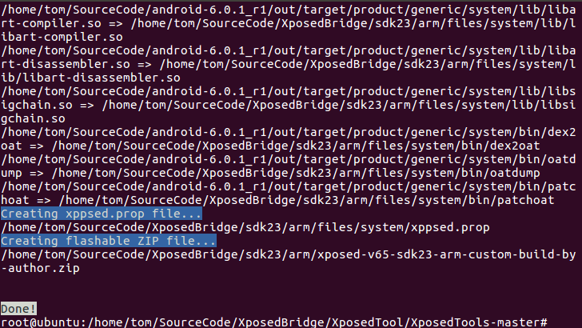

编译成功，生成文件：

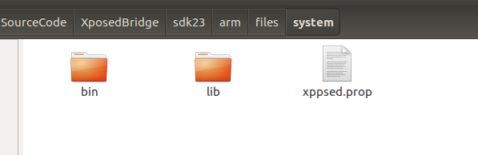

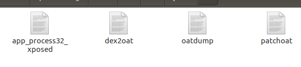

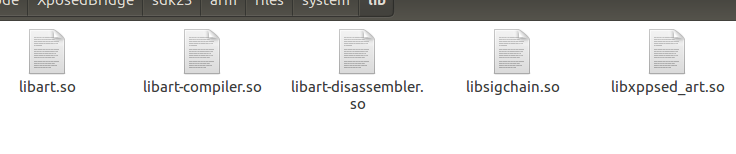

我们重新移动生成文件到源码文件夹下，具体参考上文：

```java
cp /home/tom/SourceCode/XposedBridge/sdk23/arm/files/system/bin/* .
cp /home/tom/SourceCode/XposedBridge/sdk23/arm/files/system/lib/* .
cp /home/tom/SourceCode/XposedBridge/sdk23/arm/files/system/xppsed.prop  .
```

记得将xposed编译生成的app_process32_xposed替换system/bin文件夹下的app_process32

然后我们进入源码目录下，再次编译镜像：

```
source build/envsetup.sh
lunch 19
make snod  //make snod命令的作用是重新生成镜像文件system.img
```

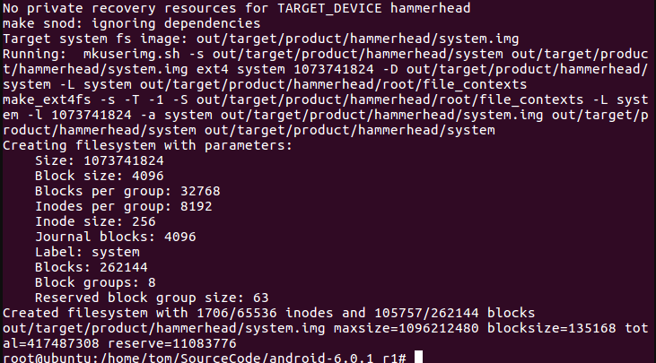

### 6.结果与验证

#### （1）结果

我们将镜像刷入手机：

```
fastboot flash system system.img
```

然后重启，发现Xposed安装成功

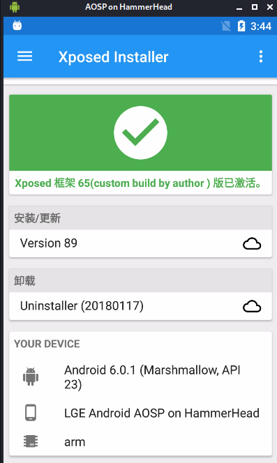

#### （2）验证

我们下载[XposedCheck](https://github.com/w568w/XposedChecker)，这里我们从官网下载源码，用Android Studio打开，然后编译安装，发现我们定制Xposed框架成功


### 7.错误

#### （1）错误1

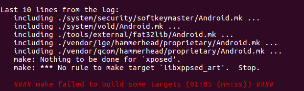

问题分析：

这是我们没有替换xposed导致的

问题解决：

我们将修改的Xposed替换原来`/SourceCode/Android-6.0.1_r1/frameworks/base/cmds/`文件夹下的xposed文件夹

#### （2）错误2

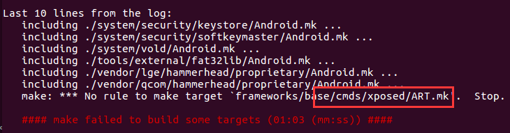

问题分析：

这是我们的Xposed文件夹首字母为大写导致

问题解决：

我们将其首字母改为小写

#### （3）错误3


错误分析：

这是xposedinstaller和XposedBridge版本不一致导致

问题解决：

匹配详细参考上文

#### （4）错误4

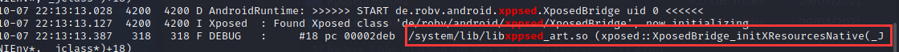

错误分析：


错误分析：

经过反复的检查，最后原来是XposedBridge.jar编译的问题

问题解决：

因为我们编译过程中，将这里给注释掉了 所以导致并没导入Android6.0的环境支持，我们需要加入支持，详细见上文

## 六、实验总结

经过几天的学习，处理完许许多多的bug，从源码分析到源码定制，花了一周终于将这几篇文章写完了，从中收获了很多，这中间参考了很多大佬的文章，在文中和参考文献中会一一列出来，如果其中还存在一些问题，就请各位大佬指正了。

后续文件资料全部会上传github: [github地址](https://github.com/guoxuaa/Android-reverse/tree/main/Android%E6%BA%90%E7%A0%81%E5%AE%9A%E5%88%B6)

## 七、参考文献

Android源码分析：

```
https://juejin.cn/post/6844903748058218509、
https://www.jianshu.com/p/2c0b76d0f4f2
https://www.jianshu.com/p/8bb770ec4c48
https://www.javatt.com/p/42078
https://blog.csdn.net/luoshengyang/article/details/8852432
https://blog.csdn.net/luoshengyang/article/details/8885792
https://www.jianshu.com/p/89d06f626540
https://www.wuyifei.cc/dex-vdex-odex-art/
https://skytoby.github.io/2019/Android%20dex%EF%BC%8Codex%EF%BC%8Coat%EF%BC%8Cvdex%EF%BC%8Cart%E6%96%87%E4%BB%B6%E7%BB%93%E6%9E%84/
https://cloud.tencent.com/developer/article/1755790
https://www.kancloud.cn/alex_wsc/androids/473620
```

Xposed：

```
https://zhuanlan.zhihu.com/p/389889716
https://www.bbsmax.com/A/MAzAq2Ynz9/
https://www.cnblogs.com/baiqiantao/p/10699552.html
https://www.jianshu.com/p/6b4a80654d4e
http://www.uml.org.cn/mobiledev/201903052.asp
https://bbs.pediy.com/thread-255836.htm
https://mp.weixin.qq.com/s/YAMCrQSi0LFJGNIwB9qHDA
```

